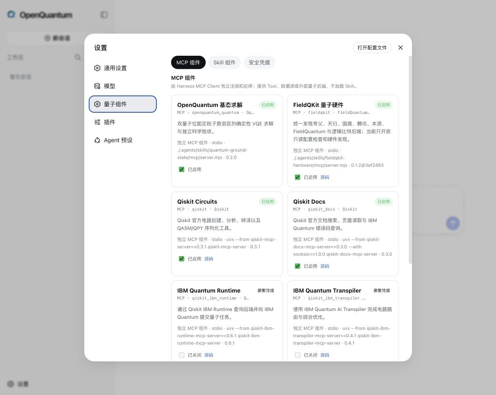

<h1 align="center">
  
</h1>

<p align="center">
  <strong>量子计算，就在指尖</strong><br />
  <sub>Quantum computing, right at your fingertips.</sub>
</p>

<p align="center">
  从桌面客户端、网页到微信，用一句话连接量子算法、工具与云端后端
</p>

<p align="center">
  <a href="https://github.com/xi-zhao/openQuantum/actions/workflows/ci.yml"></a>
  <a href="./LICENSE"></a>
  
  
</p>

<p align="center">
  <a href="#桌面客户端">桌面客户端</a> ·
  <a href="#快速开始">快速开始</a> ·
  <a href="#已集成的量子工具与能力">量子能力</a> ·
  <a href="#把你的量子能力接进来">扩展开发</a> ·
  <a href="./docs/README.md#架构总览">架构</a> ·
  <a href="./docs/communications/openquantum-wechat-launch.md">项目故事</a> ·
  <a href="./CONTRIBUTING.md">参与贡献</a>
</p>

打开桌面客户端或网页，或者把 OpenQuantum 接入微信、飞书，你就可以用一句话开始一项量子任务。让 Agent 分析量子电路、查询量子云后端、运行算法，再把结果和完整过程交还给你。

这就是 OpenQuantum，一个开源的量子 Agent 工作台。它把原本散落在代码、文档、云平台和设备接口里的量子能力，放进同一个看得见、用得上的入口。

你可以直接使用已经集成的 Qiskit、FieldQKit、本源量子（OriginQ / QPanda）、QMClaw 超导测控和量子算法能力。自己的方法和工作流可以做成 Skill，设备与数据源可以由 MCP Server 暴露为 Tool，再经 Harness MCP Client 注册，模型则通过 Provider Route 接入。普通用户可以从自然语言开始，研究机构可以组织科研工作流，量子公司也可以在这套基础上继续开发自己的产品。

OpenQuantum 基于 [DeepSeek Harness](https://github.com/deepseek-ai/deepseek-harness) 构建。Harness 提供会话、工具调度、权限、持久化和执行轨迹，OpenQuantum 在上面组织量子工具、算法 Skill、科学验收和更适合量子工作的产品界面。五分钟版本见[架构总览](docs/README.md#架构总览)。

OpenQuantum 的第一版，是在 DeepSeek Harness 发布后的三天里做出来的。它从一个很直接的想法开始，把散落在不同仓库、云平台和文档里的量子工具放进同一个工作台，让用户可以直接使用，也让研究机构和量子公司可以继续接入自己的能力。

<table>
  <tr>
    <td width="33%"><strong>一句话开始</strong><br />从桌面客户端、网页、微信或飞书发出请求，分析电路、查询后端、运行算法。</td>
    <td width="33%"><strong>每一步看得见</strong><br />工具调用、权限状态、计算结果和科学检查都保留在任务轨迹里。</td>
    <td width="33%"><strong>能力可以生长</strong><br />沿用 Skill、Tool Provider、Scientific Validator 和 Model Provider Route，继续接入设备、算法、模型和科研工作流。</td>
  </tr>
</table>

## 桌面客户端

OpenQuantum 现在提供 macOS 和 Windows 桌面客户端。它把完整的量子 Agent 工作台放进原生桌面窗口，并提供系统托盘、原生终端和桌面通知；你在客户端里使用的仍然是同一套 OpenQuantum Session、量子 Skill、Tool Provider、模型设置和科学验收。

桌面客户端基于社区开源的 [DSH Desktop](https://github.com/anywhere-labs/deepseek-harness-desktop) 适配。OpenQuantum 只接入桌面宿主，不复制 Harness Runtime，也不维护另一套会话和科研状态。

### 从源码安装

当前发布方式是从 OpenQuantum 仓库启动客户端，不是下载 `.dmg` 或 `.exe` 安装包。请先安装 [Git](https://git-scm.com/downloads) 和 Node.js 24，然后执行：

```bash
git clone https://github.com/xi-zhao/openQuantum.git
cd openQuantum
npm ci --include=dev
npm run desktop:verify-install
npm run desktop
```

首次启动会准备 Desktop profile，并可能继续下载 Electron 运行文件；终端出现这类提示时保持窗口开启即可。客户端打开后，在“设置 → 模型”中配置 Provider。要使用内置 Qiskit 等量子工具，还需要安装 [uv / uvx](https://docs.astral.sh/uv/getting-started/installation/)。

如果希望通过本地 `.env` 提供模型配置，macOS 终端运行 `cp .env.example .env`，Windows PowerShell 运行 `Copy-Item .env.example .env`，再填写所需值；直接使用设置中心时不需要创建 `.env`。

不要使用 `npm install -g dsh-plugin-desktop` 或 `npx dsh-plugin-desktop` 代替上面的命令：那会启动上游默认客户端，不会加载 OpenQuantum Agent Preset、Skill Provider、Tool Provider 和科学验收组合。OpenQuantum 品牌安装包仍属于后续发布工作。

Web 与 Desktop 共用 `.openquantum/dsh` 中的本地状态，请先停止 `npm run dev` 再切换到桌面客户端。

## 让微信成为量子计算的入口

量子计算过去常常从安装 SDK、配置环境和翻文档开始。OpenQuantum 希望把入口往前推一步。配置好消息渠道后，你可以直接在微信或飞书里发出一条消息，让同一个 OpenQuantum Agent 去调用量子工具。

```text
你在微信里提出问题
  → OpenQuantum 判断应该使用哪个 Skill
  → DeepSeek Harness 调用原生或由 MCP Server 暴露的 Tool
  → 结果回到对话，完整执行轨迹留在工作台
```

你可以让它检查一段 OpenQASM 电路，比较不同转译方案，查询 IBM Quantum、IonQ 或国内量子云后端，也可以运行 OpenQuantum 已验收的量子基态算法。需要真实硬件或付费服务时，再由使用者配置对应凭据并明确开启。

手机负责提出问题，OpenQuantum 负责连接工具，DeepSeek Harness 负责把整个过程可靠地跑起来。

量子计算，就在指尖。

## 从一个真实任务开始

下面是一段 OpenQuantum 的实际运行记录。Agent 完成了一次二量子位基态任务，先用 VQE 求解，再用独立计算检查结果。任务结果、工具调用和科学验收都保留在同一条轨迹里。

<table>
  <tr>
    <td align="center"><strong>-1.85727503 Ha</strong><br /><sub>VQE 能量</sub></td>
    <td align="center"><strong>-1.85727503 Ha</strong><br /><sub>独立精确参考</sub></td>
    <td align="center"><strong>4.44 × 10⁻¹⁶ Ha</strong><br /><sub>能量差</sub></td>
    <td align="center"><strong>通过</strong><br /><sub>科学验收</sub></td>
  </tr>
</table>

<p align="center">
  
</p>

<p align="center"><sub>真实运行画面　从任务结果到独立科学检查</sub></p>

## 近期能力升级：从能调用到能复核

这一轮不是简单增加几个量子 SDK，而是补齐了五条可运行、可检查、可失败的能力纵切，并建立一套固定 benchmark。
运行时由 Agent Preset 并列组合 Skill 与 Tool Provider：Skill 说明问题和边界，Agent 调用 Tool；Tool 由原生 Tool Plugin 注册，或由 MCP Server 暴露后经 Harness MCP Client 注册。需要科学验收时，Validator 产生 observations，Acceptance Profile 定义规则，central Acceptance Builder 汇聚 Profile、observations 和 provenance 推导 Acceptance。eval 和 benchmark 只属于开发与发布证据，不进入用户运行链。

| 新能力 | 集成形式 | 用户现在可以做什么 | 接入验收证据 |
| --- | --- | --- | --- |
| 量子信息审计 | 固定 `toqito==1.3.1` + 本地 MCP Server + Harness MCP Client + Validator + Materializer + agent-scoped Host Plugin + 内部 Scientific Result Adapter + Acceptance Profile + central Acceptance Builder | 检查密度矩阵合法性、纯度、部分转置谱和 negativity，并物化可回放的验收报告 | Bell 态纯度 1、部分转置最小本征值 -0.5、negativity 0.5，central Acceptance 为 `passed`；篡改事实为 `failed` |
| 固定量子能力 benchmark | 固定 `mqt.bench==2.2.3` + 锁定 QASM fixture、指标和 SHA-256 | 用同一分母回归检查电路工具和后续 Agent 能力，不随运行静默换题 | GHZ-3、QFT-3、BV-4 三个案例全部与锁定 manifest 匹配 |
| 受约束 QUBO 建模 | 命名二值模型编译器 + 独立穷举复核 + `pyqpanda_alg` 本地求解 | 把目标函数和线性等式约束编译成 QUBO，检查 penalty 是否足够，再比较经典最优与 QAOA | 参考模型得到赋值 `[0, 1]`、最优值 -2.0，和独立枚举一致 |
| 量子电路等价性验证 | 固定 `mqt.qcec==3.9.0` + 有界 OpenQASM 2 本地 MCP Server + Harness MCP Client | 判断转译或重写前后的无测量 unitary 电路是严格等价、相位等价、不等价还是没有确定信息 | 等价与不等价参考电路均得到预期结论 |
| QEC memory 实验 | 固定 `stim==1.16.0` + `pymatching==2.4.0` + 带 seed 的本地实验 | 运行 rotated surface-code X/Z memory 采样与 MWPM 解码，报告逻辑错误数、标准误和 Wilson 区间 | `p=0` 时 0/100；`p=0.01`、seed 123 时 59/1000，95% 区间约 4.60%–7.54% |
| QMClaw 超导测控 | QMClaw 工作流 Skill + 共享原生 Tool Provider | 规划并模拟 S21、能谱、Rabi、Ramsey、T1、SingleShot、DRAG、RB 等调校实验 | 两项深 Tool 覆盖实验目录与 13 类有界模拟；SI 单位、seed 可复现性和资源边界由离线测试锁定，结果始终标记为 simulation / not_evaluated |

这些结果证明的是固定输入下的本地执行与计算级 observations，不自动证明量子优势、QEC threshold 或真实硬件性能。
新增能力在 Result Package 和 Session Event Log 来源链没有物化时会明确保留 `provenance.not_checked`，不会把工具成功写成最终科学验收通过。目前量子基态与量子信息审计是两条完整 L3 纵切。

## 已集成的量子工具与能力

这里既有 Qiskit 提供的官方 MCP Server，也有 FieldQKit、Quantum Hardware MCP 等社区项目，还有本源量子（OriginQ / QPanda）的官方运行时 MCP Server、编程 Skill 与本地 QUBO Tool，以及 OpenQuantum 自己维护的算法 Skill、Tool Provider、Scientific Validator 和固定 benchmark。每一项都写明了来源、集成方式、默认配置和执行位置，方便使用，也方便后续维护和扩展。

| 组件 | 来源与集成方式 | 可以完成的事情 | 默认配置 / 执行位置 |
| --- | --- | --- | --- |
| Qiskit Circuits | [Qiskit 官方 MCP Server](https://github.com/Qiskit/mcp-servers) · Harness MCP Client + OpenQuantum Skill | 创建、读取、转换和分析 OpenQASM 3 / QPY 电路，比较转译结果 | 连接配置开启，无需凭据 |
| Qiskit Docs | [Qiskit 官方 MCP Server](https://github.com/Qiskit/mcp-servers) · Harness MCP Client | 查询 Qiskit API、迁移说明、错误码和 IBM Quantum 文档 | 连接配置开启，无需凭据 |
| 量子电路等价性验证 | [MQT QCEC](https://github.com/munich-quantum-toolkit/qcec) · 固定版本 + 本地 MCP Server + Harness MCP Client + OpenQuantum Skill | 检查两份有界、无测量 OpenQASM 2 电路是否严格等价、相位等价或不等价 | 连接配置开启，本地运行 |
| 量子信息审计 | [toqito](https://github.com/vprusso/toqito) · 固定版本 + 本地 MCP Server + Harness MCP Client + Validator + Materializer + agent-scoped Host Plugin + 内部 Scientific Result Adapter + Acceptance Profile + central Acceptance Builder | 审计有界密度矩阵的迹、Hermiticity、正半定性、纯度、部分转置谱和 negativity，并生成 Result Package、Acceptance Report 与回放投影 | 连接配置开启，本地运行 |
| QEC Memory 实验 | [Stim](https://github.com/quantumlib/Stim) + [PyMatching](https://github.com/oscarhiggott/PyMatching) · 固定版本 + 本地 MCP Server + Harness MCP Client + OpenQuantum Skill | 运行有界 rotated surface-code X/Z memory 实验、MWPM 解码和有限 shots 逻辑错误率统计 | 连接配置开启，本地运行 |
| FieldQKit | [FieldQuantum](https://github.com/FieldQuantum/fieldqkit) · 固定上游提交 + 非破坏性桥接 | 发现国内量子云后端，按量子位筛选，查看拓扑和校准摘要 | 云端只读；首次发现可能写入固定本地 Python 环境 |
| TyxonQ Local | [TyxonQ](https://github.com/QureGenAI-Biotech/TyxonQ) · 固定 PyPI 版本 + 本地 MCP Server + Harness MCP Client + OpenQuantum Skill | 运行小规模 statevector 电路、有限 shots 与 density-matrix 噪声仿真 | 连接配置关闭，本地能力已接入 |
| QMClaw 超导测控 | [QMC-AI/QMClaw](https://github.com/QMC-AI/QMClaw) · 固定审阅提交 + OpenQuantum Skill + 原生 Tool Provider | 运行 13 类有界、带 seed 的超导量子比特实验模拟，组织单比特调校流程 | Tool 默认注册，仅合成数据；LabRAD、参数写回和真实仪器关闭 |
| IBM Runtime | [Qiskit 官方 MCP Server](https://github.com/Qiskit/mcp-servers) · Harness MCP Client + 凭据设置 | 查询 IBM 后端，向 IBM Quantum 提交任务 | 连接配置关闭，远程执行 |
| IBM Transpiler | [Qiskit 官方 MCP Server](https://github.com/Qiskit/mcp-servers) · Harness MCP Client + 凭据设置 | 使用 IBM Quantum AI Transpiler 路由和优化电路 | 连接配置关闭，远程执行 |
| Quantum Hardware MCP | [社区项目](https://github.com/Lokesh-2025/quantum-hardware-mcp) · 固定审阅提交 + 安全开关 | 查询 IBM Quantum 与 IonQ 设备，可选提交、取消任务和估算成本 | 连接配置关闭，远程执行 |
| QPanda3 Runtime | [OriginQ 官方 MCP Server](https://github.com/OriginQ/qpanda3-runtime-mcp-server) · Harness MCP Client + 固定审阅提交 + 凭据设置 | 查询本源悟空 QPU 设备，向本源量子云提交采样、期望值与批量任务并管理任务 | 连接配置关闭，远程执行 |
| QPanda3 编程 Skill | [OriginQ 官方 Skill](https://github.com/OriginQ/pyqpanda3-skill) · 固定提交检出到 .agents/skills | pyqpanda3 电路构建、QAOA/Grover/VQE/QSVM 算法模板、pyqpanda→pyqpanda3 迁移与 QCloud 使用指导 | 尚未加载，需运行 setup |
| QPanda QUBO | [pyqpanda_alg](https://github.com/OriginQ/pyqpanda-algorithm) · 固定版本 + 本地 MCP Server 桥 + Harness MCP Client + OpenQuantum Skill | 把命名目标和线性等式约束编译成 QUBO，独立枚举检查可行最优与 penalty，再运行经典求解或可选 QAOA | 连接配置开启，本地运行 |
| Qiskit Gym | [Qiskit 官方 MCP Server](https://github.com/Qiskit/mcp-servers) · Harness MCP Client | 探索强化学习量子电路综合与优化 | 连接配置关闭，远程依赖 |
| 量子基态求解 | OpenQuantum 自研 · Skill + 原生 Tool Provider + Validator + Materializer + agent-scoped Host Plugin + 内部 Scientific Result Adapter + Acceptance Profile + central Acceptance Builder | 用一个原子 Tool 求解限定的二量子位 Hamiltonian、运行独立检查，并生成可回放 Result Commit 与 Acceptance Report | Tool 默认注册，本地运行 |
| 量子 SDK 选型 | OpenQuantum 自研 · Skill | 比较 Qiskit、Cirq、PennyLane、Q#、Braket、CUDA-Q 等工具 | 自动加载允许 |
| 固定量子能力 Benchmark | [MQT Bench](https://github.com/munich-quantum-toolkit/bench) · 固定 3-case QASM 语料 + manifest + 离线校验 | 为电路能力回归提供固定分母，分列交付、语义正确性、Validator 稳定性和 benchmark 版本 | CI 启用，不注册为 Agent Tool |

第三方组件保留原项目的版权与许可证。对应的版本、来源和 OpenQuantum 集成内容记录在 [THIRD_PARTY_NOTICES.md](THIRD_PARTY_NOTICES.md)。

<table>
  <tr>
    <td width="50%" align="center">
      
    </td>
    <td width="50%" align="center">
      
    </td>
  </tr>
  <tr>
    <td align="center"><sub>量子 Skill、MCP Server 连接与安全凭据</sub></td>
    <td align="center"><sub>从用户请求追溯到 Tool 结果</sub></td>
  </tr>
</table>

## 可以连接哪些量子后端

OpenQuantum 已经为本地模拟、IBM Quantum、IonQ 和多家国内量子云准备了入口。每个平台当前可以做什么、需要什么凭据，都可以在这里直接看到。

| 后端 | 当前能力 | 凭据或使用条件 |
| --- | --- | --- |
| 本地模拟器 | 查看模拟器元数据，运行本地量子基态参考能力 | 无需凭据 |
| IBM Quantum | Runtime、AI Transpiler、硬件查询，可选真实任务提交与取消 | `QISKIT_IBM_TOKEN`，任务类 MCP Server 连接按需开启 |
| IonQ | 硬件查询，可选真实任务提交、取消与成本估算 | `IONQ_API_KEY`，任务类 MCP Server 连接按需开启 |
| 夸父量子云 | 凭据检查、后端发现、量子位筛选、拓扑与校准摘要 | `QUAFU_API_TOKEN`，只读 |
| 天衍量子云 | 凭据检查、后端发现、量子位筛选、拓扑与校准摘要 | `TIANYAN_API_TOKEN`，只读 |
| 国盾量子云 | 凭据检查、后端发现、量子位筛选、拓扑与校准摘要 | `GUODUN_API_TOKEN`，只读 |
| 腾讯量子云 | 凭据检查、后端发现、量子位筛选、拓扑与校准摘要 | `TENCENT_API_TOKEN`，只读 |
| 本源量子云 | 只读后端发现（FieldQKit）；另经 QPanda3 Runtime MCP Server 查询悟空 QPU，并可选提交采样、期望值与批量任务 | `ORIGIN_API_TOKEN` 只读发现；`QPANDA3_API_KEY` 可选开启真机任务 |
| FieldQuantum | 云端模拟后端发现 | `FIELDQUANTUM_API_TOKEN`，只读 |
| 逻辑比特量子云 | 凭据检查、后端发现、量子位筛选、拓扑与校准摘要 | `LOGICALQUBIT_API_TOKEN`，只读 |

硬件任务和付费服务按需开启。后端发现类能力保持只读，适合先了解设备、拓扑和校准信息，再决定是否进入真实任务流程。

这里的“只读”仅指不改变云端/QPU 状态。部分固定 Python 能力会在首次调用时由 `uv` 下载依赖并在
`.openquantum/python-envs/` 创建环境，因此 Tool 合同按完整调用如实声明为 `workspace-write`；环境准备完成后，
科学计算本身仍不写外部系统。

国产量子云正在从“只读发现”走向“真机执行”：本源量子（OriginQ）官方的 [QPanda3 Runtime MCP Server](https://github.com/OriginQ/qpanda3-runtime-mcp-server) 已经接入，默认关闭。运行 `npm run mcp:qpanda-runtime:setup` 检出固定审阅提交，在设置中心配置 `QPANDA3_API_KEY` 并手动开启后，即可连接悟空真机。完整的本源生态候选与取舍见 [量子能力清单](docs/ecosystem/QUANTUM_CAPABILITY_CATALOG.md)。

## 每一步，都看得见

做量子任务时，一个结果往往不够。OpenQuantum 会把用户请求、Skill 加载、工具调用、权限状态和返回结果连成一条清晰的执行轨迹。

使用者可以知道 Agent 调用了什么，开发者也可以沿着这条轨迹定位模型、工具、权限和外部服务中的问题。对科研工作来说，这份过程记录和最终数字一样重要。

## 运行完成之后，还有科学验收

OpenQuantum 把任务运行和科学验收分开显示。`quantum-ground-state` 是一个小而完整的参考能力，它在固定扇区内运行二量子位无噪声 statevector VQE，再用独立程序检查能量、态矢、收敛轨迹和数值残差。

当前已有两条完整 L3 科学验收纵切：明确限定的二量子位实 Pauli Hamiltonian，以及有界密度矩阵的量子信息审计。QUBO、电路等价性验证和 QEC memory 实验目前具备计算级独立 observations，但在结果文件和 Session Event Log 来源链没有物化时不会自行升级成最终 Acceptance。这个分层展示了一项量子能力怎样从计算、证据一路走到可复核结论，也为社区开发更丰富的 Skill、Tool Provider 和 Validator 提供了可以直接参考的起点。

## 快速开始

准备 Git、Node.js 24，以及用于启动 Qiskit 工具的 [uv / uvx](https://docs.astral.sh/uv/getting-started/installation/)。

```bash
git clone https://github.com/xi-zhao/openQuantum.git
cd openQuantum
npm ci
npm run dev
```

浏览器打开 <http://127.0.0.1:3000>。

模型地址、模型密钥、MCP Server 连接、Skill 和量子云凭据都可以从设置中心管理。量子组件默认先展示当前 Model、Skill、Tool Registry 的只读运行证据，再把 MCP Server 连接、Skill 加载策略和安全凭据分栏配置；“配置已启用”不会被当成“当前已就绪”。密钥保存在本地环境或 DeepSeek Harness 凭据库中，项目配置只保留凭据引用。

如果不用设置中心，而是通过本地环境文件配置模型，macOS 终端运行 `cp .env.example .env`，Windows PowerShell 运行 `Copy-Item .env.example .env`，再填写需要的值。

### 也可以直接打开桌面客户端

请按[桌面客户端](#桌面客户端)中的完整源码安装流程执行。客户端能力、状态共享边界与故障检查见[部署与启动](docs/DEPLOYMENT.md)。

还没有配置模型时，也可以先运行本地量子示例。

```bash
npm run demo:quantum-ground-state
npm run mcp:qiskit:probe
```

### 把量子计算带进微信、飞书和更多消息平台

OpenQuantum 集成了 [CC Connect](https://github.com/chenhg5/cc-connect)。它通过标准 ACP 连接 DeepSeek Harness，让手机里的对话直接通向 OpenQuantum 已有的 Skill Provider、Tool Provider 和科学验收流程。

```bash
npm run cc-connect:setup
npm run cc-connect:feishu
npm run cc-connect:start

# 在另一个终端打开本地管理后台，继续管理消息平台及其凭据
npm run cc-connect:web
```

飞书也可以替换为微信、钉钉、企业微信、Slack、Telegram、Discord、QQ 等 CC Connect 支持的平台。第一项平台需要先按上游方式完成配置，服务才会启动。消息平台的 Token 只保存在被 Git 忽略的 CC Connect 本地配置中。详细说明见[消息渠道接入](docs/integrations/CC_CONNECT.md)。

Linux 用户也可以让容器通过 host network 在本机回环地址运行。Harness 不允许监听 `0.0.0.0`，因此这不是远程服务器暴露方式。

```bash
cp .env.example .env
docker compose up --build
```

更完整的启动方式见[部署与启动](docs/DEPLOYMENT.md)。模型 Provider、MCP Server 与 Harness MCP Client 连接、凭据或 Harness 遇到问题时，可以从[故障排查](docs/TROUBLESHOOTING.md)快速找到对应入口。

## 把你的量子能力接进来

OpenQuantum 沿用 DeepSeek Harness 的“一切皆 Plugin”装配方式：可组合能力统一通过 Cordis Plugin 进入
Runtime、获得依赖并随 scope 回收；但 Plugin 只是装配机制，产品职责按下面六组理解：

| 层级 | 核心对象 | 它解决什么问题 |
| --- | --- | --- |
| 产品 | Capability、Application Interface | 用户获得什么能力；同一用例的规则由谁统一拥有 |
| 装配 | Cordis Plugin、Agent Preset、Deployment Composition | 模块怎样进入 Runtime，以及 Agent/Host 分别组合什么 |
| Agent Interface | Skill、Tool | Agent 怎样理解任务；唯一可以直接调用什么动作 |
| 集成 | Tool Provider、Harness MCP Client、MCP Server、External API Adapter | Tool 怎样注册，以及进程外、远程或厂商能力怎样接入 |
| 科学证据 | Materializer、Validator、Acceptance Profile、central Acceptance Builder | 怎样从真实证据形成 observations，并唯一推导 Acceptance |
| 开发证据 | Eval、Benchmark、Capability conformance | 怎样在开发和发布期发现回归；不进入用户请求链 |

因此，“一切皆 Plugin”回答能力怎样进入 DSH；Skill、Tool、MCP Server、Validator 等名称回答能力负责什么。
Scientific Validator 或领域算法可以是 Plugin 内部的普通模块，不需要为了形式统一而各自成为 Plugin。

接入新能力时，先定义 Agent 真正需要的最小 Tool surface：进程内、同语言且无需隔离时默认使用原生 Tool Provider；只有独立进程、跨语言、远程部署或明确隔离边界才使用 MCP Server + Harness MCP Client。Skill 与 Tool 相互独立，只有 Skill 确实增加领域选择、工作步骤或解释边界时才组合。涉及科学主张时，再增加 Validator、Acceptance Profile、Materializer 和测试，由 central Acceptance Builder 唯一推导最终状态。

先读[文档与架构入口](docs/README.md)，再按任务进入[贡献指南](CONTRIBUTING.md)、
[扩展对象模型](docs/architecture/EXTENSION_MODEL.md)、[模块地图](docs/architecture/MODULES.md)或
[架构审计](docs/architecture/ARCHITECTURE_AUDIT.md)。

<details>
<summary><strong>开发与验证命令</strong></summary>

```bash
# 检查 Harness 组合配置
npm run harness:config

# 运行完整离线质量检查
npm run check

# 配置模型后运行真实 Agent 端到端测试
npm run e2e:quantum-harness -- --provider openquantum-public
```

```text
.agents/skills/          量子 Skill 与科学资源
runtime/openquantum/     Agent Preset、原生 Tool Provider、Harness MCP Client 声明和 Harness 界面扩展
src/settings/server/     设置中心的服务端配置边界
src/readiness/server/    当前 Harness Registry 的只读运行状态边界
scripts/                 启动、诊断和端到端测试
tests/                   平台集成测试
docs/                    架构、路线与生态文档
```

更完整的文档入口见 [docs/README.md](docs/README.md)。

</details>

## 一起建设 OpenQuantum

当前版本已经包含桌面客户端、Web 工作台、微信/飞书等消息入口、Harness 执行轨迹、量子 Skill、Tool Provider、模型与凭据设置，以及基态求解、量子信息审计、受约束 QUBO、电路等价性验证、QEC memory 实验、QMClaw 超导测控模拟和固定 benchmark。真实硬件和付费服务由使用者按需配置与开启。

我们希望 OpenQuantum 成为一块开放的底板。量子公司可以在这里接入设备和服务，高校实验室可以沉淀自己的科研流程，算法团队和工具作者也可以把新的方法交给更多人使用。

如果你想贡献代码、Skill、Tool Provider、Validator、文档或案例，欢迎阅读 [CONTRIBUTING.md](CONTRIBUTING.md)。安全问题可以按照 [SECURITY.md](SECURITY.md) 提供的方式私密报告。

## License

OpenQuantum 自有代码采用 [MIT License](LICENSE)，版权所有 © 2026 Xi Zhao。

DeepSeek Harness、Qiskit MCP Servers、FieldQKit、Quantum Hardware MCP 和其他第三方组件沿用各自的许可证，详细来源见 [THIRD_PARTY_NOTICES.md](THIRD_PARTY_NOTICES.md)。
