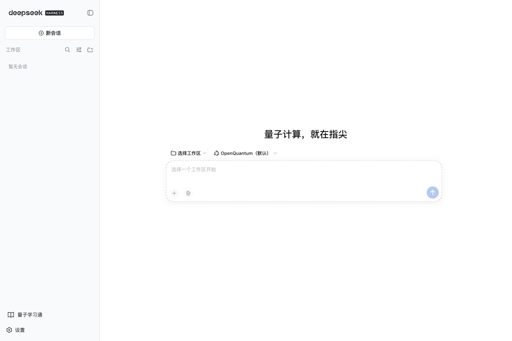
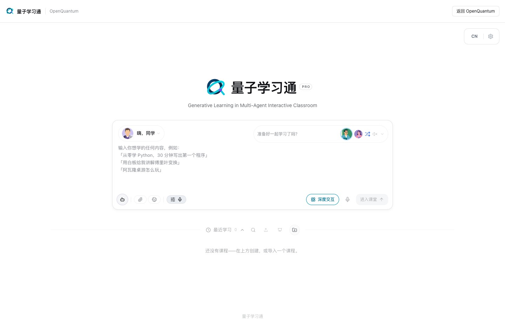
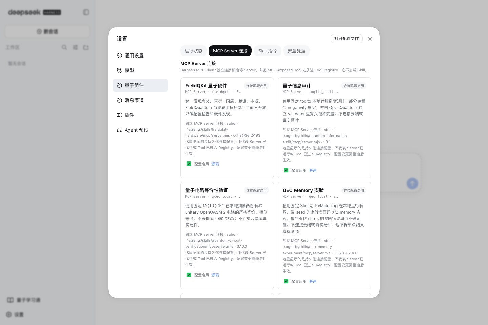
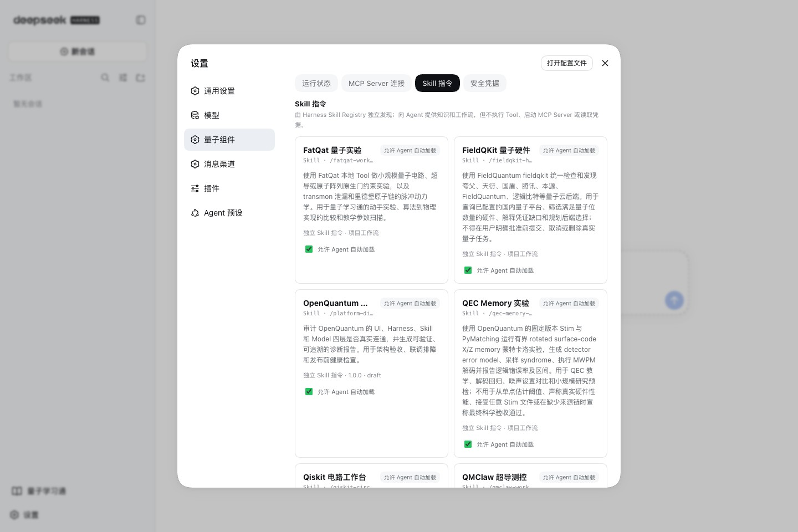
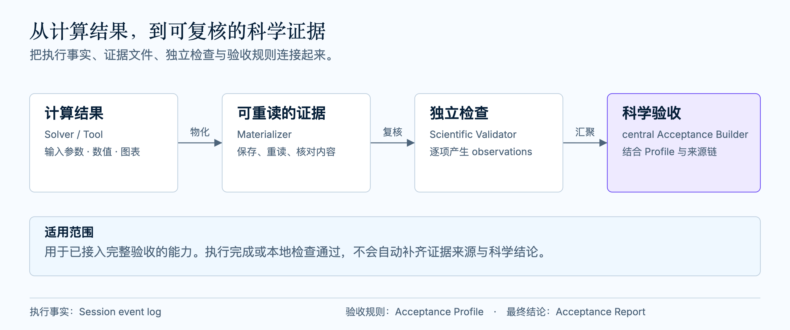
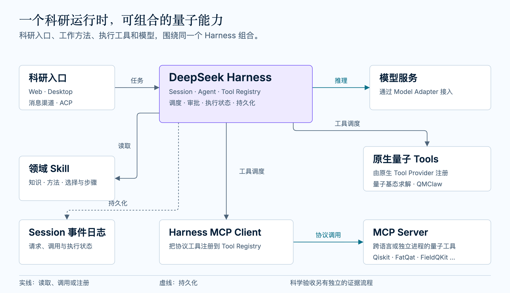

<h1 align="center">
  
</h1>

<p align="center">
  <strong>量子计算，就在指尖</strong><br />
  <sub>Quantum computing, right at your fingertips.</sub>
</p>

<p align="center">
  面向研究者、学习者与授课者的开源量子 AI 工作台<br />
  在同一处选择工具、运行计算、组织课程
</p>

<p align="center">
  <a href="https://github.com/xi-zhao/openQuantum/actions/workflows/ci.yml"></a>
  <a href="./LICENSE"></a>
  
</p>

<p align="center">
  <a href="#openquantum-全景">平台全景</a> ·
  <a href="#可以用它做什么">能力全景</a> ·
  <a href="#集成生态与自由选择">集成生态</a> ·
  <a href="#产品体验">产品体验</a> ·
  <a href="#快速开始">快速开始</a> ·
  <a href="#从一个真实任务开始">真实案例</a> ·
  <a href="./docs/README.md">文档与架构</a>
</p>

**分析电路、模拟实验、连接量子云，也能准备一堂量子课程。** OpenQuantum 把量子计算工具与教学应用集成到一个工作台，供研究、学习和教学使用。

你选择模型与计算后端，用自然语言发起科研任务。工具调用与结果留在工作台里，方便回看和继续分析；课程材料、课堂与课件则在量子学习通中组织。

已接入 **Qiskit · toqito · Stim · PyMatching · FatQat · QMClaw · QPanda · TyxonQ · FieldQKit** 等工具，具体用途与使用条件见[集成生态](#集成生态与自由选择)。

**[安装并开始](#快速开始)**　·　[先看本地计算示例](#从一个真实任务开始)（无需模型密钥）

## OpenQuantum 全景

科研工作台处理计算与分析，量子学习通组织课程与课堂。两者在同一产品中提供入口；计算工具、模型服务和研究方法可以按任务选择、配置和扩展。

<table>
  <tr>
    <td width="50%" align="center">
      <a href="./docs/images/openquantum-workbench-20260912.jpg"></a><br />
      <strong>科研工作台</strong><br /><sub>发起任务，选择工具，查看结果</sub>
    </td>
    <td width="50%" align="center">
      <a href="./docs/images/openquantum-learning-20260912.jpg"></a><br />
      <strong>量子学习通</strong><br /><sub>组织材料、课程与课堂；课程体系正在建设</sub>
    </td>
  </tr>
</table>

点击截图可查看原图。科研任务支持网页、桌面和配置好的消息入口；教学应用从工作台侧栏打开，详见[产品体验](#产品体验)。

## 可以用它做什么

从你想完成的任务开始。每个方向都对应已接入的工具或应用，具体的物理假设、输入规模与检查范围见[完整目录](#已集成的量子工具与能力)。

| 任务方向 | 可以发起的任务 | 可以查看的结果 |
| --- | --- | --- |
| 量子电路 | 分析或转换 OpenQASM / QPY 电路，比较转译，检查等价性，运行小规模仿真 | 电路结构、转译结果、等价性检查、态矢或采样分布 |
| 量子态与基态 | 审计密度矩阵与纠缠指标；求解限定二量子位 Hamiltonian 的固定粒子扇区基态 | 状态指标与独立检查，VQE 和精确参考的数值对照 |
| 组合优化 | 构建有界 QUBO，检查约束 penalty，运行经典求解或可选本地 QAOA | 优化解、约束检查与经典枚举复核 |
| 量子纠错 | 运行 surface-code memory 实验，进行 MWPM 解码 | 有限 shots 下的逻辑错误率及统计范围 |
| 超导与原子实验 | 模拟调校流程、原生门约束、三能级 transmon 泄漏或小型里德堡原子链动力学 | 合成实验数据、动力学轨迹与图表 |
| 量子硬件接入 | 发现后端、检查拓扑与凭据；按需启用云任务查询、提交与取消 | 设备候选、使用条件；已启用任务接口的结果与状态 |
| 研究方法与工具选型 | 比较量子 SDK、复用研究步骤、排查工作台连接 | 选型建议、工作流说明与诊断记录 |
| 学习与教学 | 准备材料、制作课件、组织互动课堂与 PBL 项目式学习 | 已集成课程与课堂界面、本机学习记录；[课程建设与 AI 验收进度](#量子学习通) |

本地计算可从无需量子云凭据的任务开始；真实硬件与付费服务按需启用。你也可以把自己的算法和研究方法[接入工作台](#把你的量子能力接进来)。

## 集成生态与自由选择

同一个 Bell 态任务，可以选择 FatQat 或 TyxonQ；需要分析与转译电路时，可以选择 Qiskit；比较两份电路是否等价时，可以选择 MQT QCEC。OpenQuantum 保留这些选择，让输入格式、物理模型和设备条件决定使用哪种工具。

| 生态层面 | 已接入的项目或服务 | 选择方式与当前范围 |
| --- | --- | --- |
| 电路、编译与仿真 | [Qiskit](https://github.com/Qiskit/mcp-servers)、[MQT QCEC](https://github.com/munich-quantum-toolkit/qcec)、[TyxonQ](https://github.com/QureGenAI-Biotech/TyxonQ)、[FatQat](https://github.com/spaceqat/fatqat) | 按电路格式、噪声模型、等价性检查或硬件约束选择；部分连接按需开启 |
| 量子态、优化与纠错 | [toqito](https://github.com/vprusso/toqito)、[QPanda QUBO](https://github.com/OriginQ/pyqpanda-algorithm)、[Stim](https://github.com/quantumlib/Stim)、[PyMatching](https://github.com/oscarhiggott/PyMatching)，以及内置基态求解 | 覆盖量子态审计、限定基态计算、组合优化和纠错存储实验 |
| 超导与原子实验 | [QMClaw](https://github.com/QMC-AI/QMClaw)、[FatQat](docs/integrations/FATQAT.md) | 调校流程的合成数据实验、原生门约束和有界脉冲动力学 |
| 量子云与硬件 | [FieldQKit](https://github.com/FieldQuantum/fieldqkit)、IBM Quantum、IonQ、本源量子及其他国内量子云 | 按厂商与任务选择；后端发现需要对应凭据，真机与付费任务按需启用 |
| 学习与教学 | [OpenMAIC](https://github.com/THU-MAIC/OpenMAIC) → 量子学习通 | 集成完整教学应用；课程体系正在建设，在线 AI 教学流程仍待完整验收 |
| Agent、桌面与消息 | [DeepSeek Harness](https://github.com/deepseek-ai/deepseek-harness)、[DSH Desktop](https://github.com/anywhere-labs/dsh-desktop)、[CC Connect](docs/integrations/CC_CONNECT.md) | 从网页、桌面或配置好的消息渠道使用科研能力 |

可以在对话中直接指定后端名称。[首次任务示例](#发起任务并选择后端)给出了 FatQat 和 TyxonQ 的可复制请求及准备条件。

### 模型由你选择

在设置中心接入自己的模型服务，按任务需要选择模型。对话模型负责理解与组织任务，计算后端负责执行相应的量子计算；两者分别配置。切换模型后，可以继续使用已有的研究方法和工具，具体协议兼容性以当前适配和实测为准。

具体的 [Skill 目录](#内置-skills)、[MCP 服务目录](#mcp-服务目录)、[原生量子 Tools](#原生量子-tools)和[量子后端范围](#可以连接哪些量子后端)保留在后文，便于查询连接名、依赖与使用条件。

## 产品体验

### 科研工作台

在对话中写清任务、输入和希望使用的后端。Agent 按任务读取工作方法、调用工具，工作台保留请求与返回结果。使用尚未开启的后端时，先在设置中心启用连接并重启工作台，再在对话中指定它。

<p align="center">
  <br />
  <sub>在连接目录中选择后端；配置是否启用与当前运行状态分别展示。</sub>
</p>

<p align="center">
  <br />
  <sub>工作方法与执行后端分别管理，可按研究任务组合使用。</sub>
</p>

### 量子学习通

把材料、课件和课堂放在一起，方便授课与自主学习。量子学习通集成了 [OpenMAIC](https://github.com/THU-MAIC/OpenMAIC) 的完整原版界面与服务端，保留教学流程和编辑操作，应用名称与主题适配 OpenQuantum，课程内容保留自身样式。

| 学习与教学场景 | 集成内容 |
| --- | --- |
| 准备材料 | 首页、课程库、材料附件、课程导入与 PPTX 导入 |
| 课堂学习 | 幻灯片、测验、互动问答与 PBL 项目式学习 |
| 制作课程 | 建课预览、课件编辑器和 Pro 专业工作台 |
| 继续学习 | 本机课程、任务、材料与服务端学习记录持久化，兼容旧版课堂迁移 |

课程建设目标是覆盖中学基础到前沿研究，按初级、中级、高级组织内容，允许按知识基础跨阶段学习。当前公开资源仍在整理，完整课程体系尚未制作和发布。应用装配、启动和本机持久化已有验证，真实在线 AI 建课、问答和编辑仍待完整验收。

Pro 教学任务使用上游应用自己的工具与记录，尚未自动接入科研工作台的量子工具。媒体、语音和搜索等可选能力需要对应服务配置。安装、备份、迁移与逐项验证见[量子学习通集成说明](docs/integrations/OPENMAIC.md)。

启动步骤见[量子学习通安装](#量子学习通安装)。

### 在桌面和消息中使用

桌面端基于 [DSH Desktop](https://github.com/anywhere-labs/dsh-desktop) 适配，提供原生窗口、系统托盘、终端与通知，复用 OpenQuantum 的模型、科研能力和执行记录。当前提供 macOS / Windows 源码启动路径；本机已验证 macOS，未提供 OpenQuantum 品牌的 `.dmg` / `.exe` 安装包。

[CC Connect](docs/integrations/CC_CONNECT.md) 通过标准 ACP 连接 Harness，可从微信、飞书、钉钉、Slack、Telegram、Discord 等平台发起科研任务。消息入口复用已有 Skill、Tool 和科研执行记录。

<p align="center">
  <br />
  <sub>微信渠道的对话入口示例；渠道配置完成后，消息由 CC Connect 转交 Harness。</sub>
</p>

对应启动方式见[桌面客户端](#桌面客户端)与[微信、飞书等消息入口](#微信飞书与其他消息入口)。

## 从一个真实任务开始

以仓库内固定的[二量子位 Pauli Hamiltonian](.agents/skills/quantum-ground-state/evals/fixtures/requests/protocol-fixture.json)为例，OpenQuantum 在指定粒子扇区内运行无噪声 VQE，再用独立闭式计算作为参考。在仓库目录执行以下命令即可复算，无需模型密钥或量子云凭据：

```bash
npm run demo:quantum-ground-state
```

以下结果来自 **2026-09-12 的本地复验**；[原始输出与运行记录](docs/examples/quantum-ground-state-local-demo-2026-09-12.json)包含完整数值、检查状态、时间、源码提交、输入摘要和 Node.js 版本。

<table>
  <tr>
    <td align="center"><strong>-1.85727503 Ha</strong><br /><sub>VQE 能量</sub></td>
    <td align="center"><strong>-1.85727503 Ha</strong><br /><sub>独立精确参考</sub></td>
    <td align="center"><strong>4.44 × 10⁻¹⁶ Ha</strong><br /><sub>能量差</sub></td>
    <td align="center"><strong>15 项通过</strong><br /><sub>本地计算检查</sub></td>
  </tr>
</table>

这次运行完成了 15 项本地计算检查，1 项会话来源检查未执行，尚未生成完整科学验收结论。差值表示该数值案例与精确参考的一致程度；科学适用范围仍是给定 Hamiltonian 和粒子扇区。

完整科学验收还需要通过 Harness 执行任务、保存结果文件和会话来源，并生成可重读的验收报告。配置模型后的验证入口见下方[开发与验证命令](#把你的量子能力接进来)。

### 执行记录与科学验收

科研工作台保留请求、Skill 加载、工具调用、权限状态与返回结果，便于追踪一次任务的执行过程。设置中的“已启用”表示配置策略；当前工具是否可调用、服务是否可达，需要查看对应运行证据。

运行完成与科学验收分别显示。具备完整验收流程的能力会把输入、结果文件、独立检查和会话记录连接起来，生成验收报告，列出通过、失败或尚未检查的项目。其他工具按各自范围报告数值结果和检查状态。



图中展示已接入完整科学验收的能力如何形成证据；[查看可编辑图源](docs/architecture/openquantum-evidence-flow.html)。

限定量子基态求解与量子信息审计提供完整科学验收流程；QUBO、电路等价性检查和量子纠错存储实验等能力按各自规则报告计算结果与检查。验证依据见[能力声明](.agents/capability-packages.yml)、[架构审计](docs/architecture/ARCHITECTURE_AUDIT.md)和[固定量子能力 Benchmark](benchmarks/quantum-capabilities/README.md)。

## 开始前的几个问题

<details>
<summary><strong>需要量子计算机账户或模型密钥吗？</strong></summary>

本地量子计算无需量子云凭据。安装依赖后，仓库内的基态示例还可以直接运行，无需模型密钥。通过 Agent 发起任务需要配置模型服务；使用量子云则按所选服务配置凭据并启用连接。

</details>

<details>
<summary><strong>需要先学会每个量子 SDK 吗？</strong></summary>

可以先用自然语言提出任务，由 Agent 调用已接入的工具。你仍需要明确输入、物理假设与希望检查的结果。具体 Tool 名称、输入范围和后端选择在目录中保留，方便需要时深入使用。

</details>

<details>
<summary><strong>量子学习通已经有完整课程体系了吗？</strong></summary>

目前已集成教学应用，公开教学资源仍在整理。课程建设目标覆盖中学基础至前沿研究，按初、中、高组织；完整课程体系尚未发布，真实在线 AI 建课、问答和编辑仍待完整验收。

</details>

<details>
<summary><strong>本地启动需要准备什么？</strong></summary>

当前提供源码安装，需要 Git、Node.js 24，以及 Python 量子工具使用的 uv。可以先启动网页工作台，再按需安装桌面端、量子学习通或消息入口；各平台要求见下面的启动步骤。

</details>

**[开始安装](#快速开始)**　·　[先查看本地示例的输入与结果](#从一个真实任务开始)

## 快速开始

当前以源码分发，适合本机单用户试用及二次开发。

准备 Git、Node.js 24，以及供 Python 量子工具使用的 [uv / uvx](https://docs.astral.sh/uv/getting-started/installation/)。

### 网页工作台

```bash
git clone https://github.com/xi-zhao/openQuantum.git
cd openQuantum
npm ci
npm run dev
```

首次打开启动日志中带登录令牌的地址，认证后会跳转到 <http://127.0.0.1:3000>，再在设置中心配置模型。还没有模型密钥时，可先用 `npm run demo:quantum-ground-state` 运行本地参考示例；安装 `uv` 后可用 `npm run mcp:qiskit:probe` 检查 Qiskit 接入，首次运行可能下载依赖。

### 配置模型

密钥保存在本地环境或 Harness 凭据库中，项目配置只保存凭据引用。若希望使用 `.env`，macOS 终端执行 `cp .env.example .env`，Windows PowerShell 执行 `Copy-Item .env.example .env`，再填写所需配置。

### 发起任务并选择后端

在科研工作台新建对话，直接写出任务和希望使用的后端。下面是同一个 Bell 态任务的两种选择，可以分别复制到对话中：

| 选择 | 示例请求 | 准备条件 |
| --- | --- | --- |
| FatQat | 用 FatQat 从双量子位全零态出发，对 q0 施加 H，再以 q0 为控制位、q1 为目标位施加 CX。返回无噪声精确概率，并用 1024 次采样、seed=7 比较频数。 | 默认连接开启；已安装 `uv` |
| TyxonQ | 用 TyxonQ 从双量子位全零态出发，对 q0 施加 H，再以 q0 为控制位、q1 为目标位施加 CX。返回无噪声精确态矢和概率。 | 先启用 TyxonQ Local 连接 |

两种计算的理想概率都应为 `00`、`11` 各约 50%；有限采样频数会有波动。首次使用可能下载相应的 Python 依赖。

TyxonQ 等默认关闭的后端，在「设置 → 量子组件 → MCP Server 连接」中启用后，重新启动 OpenQuantum，再在对话中指定名称。修改模型配置选择的是对话模型；这里选择的是负责计算的后端。支持范围和默认开关见[服务目录](#mcp-服务目录)。

### 量子学习通安装

量子学习通当前已在 macOS 验证安装和启动。完成仓库依赖安装后，macOS 用户可运行 `npm run learning:ui:setup`，再启动 Web 或 Desktop，从侧栏打开「量子学习通」。首次打开会自动启动本机数据库和课程服务，无需另装全局 PostgreSQL；模型请求使用 OpenQuantum 当前选择的模型。

学习应用的安装器依赖 `/bin/sh`，尚未适配普通 Windows 环境；Linux 安装与启动也未完成验证。各平台状态见[安装说明](docs/integrations/OPENMAIC.md#使用)。

### 桌面客户端

桌面端的界面与平台状态见上方[产品体验](#在桌面和消息中使用)。

完成仓库依赖安装，并准备 Corepack 和系统 C++ 构建工具后：

```bash
npm run desktop:setup
npm run desktop:verify-install
npm run desktop
```

`desktop:setup` 构建固定的上游源码、下载 Electron 并编译原生模块；首次启动可能显示设置向导。请使用仓库中的启动命令，以加载 OpenQuantum 的模型和量子能力配置。

Web 与 Desktop 共用 `.openquantum/dsh` 中的本机状态，切换前先退出正在运行的入口。量子学习通另有安装和平台要求，见[量子学习通](#量子学习通)。

### 微信、飞书与其他消息入口

消息渠道通过 CC Connect 连接科研工作台；配置好相应平台后即可发起任务。

```bash
npm run cc-connect:setup
npm run cc-connect:feishu
npm run cc-connect:start
```

第一项平台需先按上游方式配置。可在另一个终端运行 `npm run cc-connect:web` 打开本地渠道管理后台，配置其他平台及凭据。平台 Token 保存在被 Git 忽略的本地配置中。

其他部署方式、模型配置和故障定位见[部署与启动](docs/DEPLOYMENT.md)与[故障排查](docs/TROUBLESHOOTING.md)。源码升级的固定版本、兼容性和验证记录见[上游升级记录](docs/releases/2026-09-10-upstream-update.md)。

## 把你的量子能力接进来

项目基于 [DeepSeek Harness](https://github.com/deepseek-ai/deepseek-harness)：Harness 负责通用 Agent 运行、工具调度、模型连接与执行记录，OpenQuantum 提供量子领域能力和应用集成。



这张图展示科研工作台的核心调用关系；[查看可编辑图源](docs/architecture/openquantum-platform-overview.html)。量子学习通的课程任务和数据沿用完整子应用的职责边界，详见[应用集成说明](docs/integrations/OPENMAIC.md)。

先确定用户需要解决的任务，再选择扩展方式：

| 需要增加什么 | 放在哪里 |
| --- | --- |
| 领域知识、步骤、工具选择与结果解释 | Skill，可复用已有通用或量子 Tool |
| 稳定的计算、查询或操作 | Tool，由原生 Tool Provider 或 Harness MCP Client 注册 |
| 独立的科学检查与验收 | Validator；需要最终验收时再组合 Acceptance Profile、证据物化与 central Acceptance Builder |
| 有独立交互流程的完整产品 | 按应用边界集成，保留其业务与数据职责；量子学习通是现有实例 |

在开发文档中，`L3` 表示具备可回放的完整科学验收流程。Validator 产生检查结果，Acceptance Profile 定义规则，只有 central Acceptance Builder 汇聚检查结果与来源链、推导最终验收状态。能力等级不代表每一次调用都已完成验收。

Skill 与 Tool 可独立存在。计算后端按任务需要选用，只有额外的选择、步骤或解释规则有价值时才增加 Skill。进程内、同语言且无需隔离的动作优先使用原生 Tool Provider；跨语言、独立进程或远程部署时使用 MCP Server，由 Harness MCP Client 注册其 Tool。

Harness 是通用 Agent Runtime，扩展通过 Cordis Plugin 装配。UI、模型连接、量子计算和科学判定各自保持职责边界。完整外部子应用的教学任务与数据归上游应用维护，其任务不自动获得 Harness Session、科研审批或科学验收语义。

开发前先读[文档与架构入口](docs/README.md)，按需要查阅[贡献指南](CONTRIBUTING.md)、[扩展对象模型](docs/architecture/EXTENSION_MODEL.md)和[模块地图](docs/architecture/MODULES.md)。

<details>
<summary><strong>开发与验证命令</strong></summary>

```bash
# 检查 Harness 组合配置
npm run harness:config

# 运行完整离线质量检查
npm run check

# 配置模型后运行真实 Agent 端到端测试
npm run e2e:quantum-harness -- --provider openquantum-public
```

```text
.agents/skills/          量子 Skill 与科学资源
runtime/openquantum/     Agent Preset、原生 Tool Provider、Harness MCP Client 声明和 Harness 界面扩展
src/settings/server/     设置中心的服务端配置边界
src/readiness/server/    当前 Harness Registry 的只读运行状态边界
scripts/                 启动、诊断和端到端测试
tests/                   平台集成测试
docs/                    架构、路线与生态文档
```

更完整的文档入口见 [docs/README.md](docs/README.md)。

</details>

界面截图与示意图的版本、来源和适用范围见[图片说明](docs/images/README.md)。

## 已集成的量子工具与能力

当前源码分发 **18 个内置 Skill、20 个 MCP 服务连接、3 个原生量子 Tool**；另提供 1 个可选上游 Skill 的安装入口。它们是三种不同的职责，不应相加当作独立科研能力数量：

- **Skill 是工作方法**：告诉 Agent 何时使用哪些工具、按什么步骤做、怎样解释结果。
- **Tool 是执行动作**：Agent 真正调用的计算、查询或操作。
- **MCP Server 是工具服务**：通过协议提供 Tool，由 Harness MCP Client 连接并注册；Skill 本身不启动服务。

从上方能力全景选择方向，再到以下目录确认工作流、执行工具、依赖与开关。清单以仓库默认配置为准，不包含使用者自行安装的扩展；“默认开启”不代表依赖已安装、凭据已配置或服务当前在线。

<p>
  <a href="#内置-skills">Skill 目录</a> ·
  <a href="#mcp-服务目录">MCP 服务目录</a> ·
  <a href="#原生量子-tools">原生量子 Tools</a> ·
  <a href="#可以连接哪些量子后端">量子后端范围</a>
</p>

### 内置 Skills

这 12 个 Skill 随源码提供，由 Harness 按任务需要发现和加载。点击名称即可查看完整的 `SKILL.md`，包括适用范围、执行步骤与限制；Skill 可加载不等于它使用的 MCP 服务已开启。

| Skill | 适合什么任务 | 使用的执行能力 |
| --- | --- | --- |
| [`quantum-sdk-advisor`](.agents/skills/quantum-sdk-advisor/SKILL.md) | 量子 SDK 选型、迁移比较与 PoC 技术路线 | 知识型 Skill，不强制绑定专用 Tool；提及某个 SDK 不等于已经集成其执行后端 |
| [`qiskit-circuit-workbench`](.agents/skills/qiskit-circuit-workbench/SKILL.md) | OpenQASM 3 / QPY 电路分析、转换、转译比较与文档查证 | `qiskit`、`qiskit_docs` 服务提供的 Tools |
| [`quantum-circuit-verification`](.agents/skills/quantum-circuit-verification/SKILL.md) | 用 MQT QCEC 检查两份有界、无测量 OpenQASM 2 电路的等价性 | `qcec_local` 服务提供的 Tool |
| [`quantum-information-audit`](.agents/skills/quantum-information-audit/SKILL.md) | 审计密度矩阵合法性、纯度、部分转置谱与 negativity | `toqito_audit` 服务提供的 Tool；可接完整科学验收链 |
| [`quantum-ground-state`](.agents/skills/quantum-ground-state/SKILL.md) | 二量子位实 Pauli Hamiltonian 在固定粒子扇区内的 VQE 与精确参考比较 | 原生 `solve_and_validate_ground_state`；可接完整科学验收链 |
| [`qpanda-qubo`](.agents/skills/qpanda-qubo/SKILL.md) | 有界 QUBO 建模、penalty 检查、经典枚举复核与可选本地 QAOA | `qpanda_qubo` 服务提供的 Tools；不提交云任务 |
| [`qec-memory-experiment`](.agents/skills/qec-memory-experiment/SKILL.md) | surface-code X/Z memory 采样、MWPM 解码与有限 shots 统计 | `qec_local` 服务提供的 Tool；不从单点结果宣称阈值 |
| [`fieldqkit-hardware`](.agents/skills/fieldqkit-hardware/SKILL.md) | 国内量子云后端发现、量子位筛选、拓扑与凭据缺口检查 | `fieldqkit` 服务提供的 Tools；只读云端，不提交 QPU 任务 |
| [`tyxonq-workbench`](.agents/skills/tyxonq-workbench/SKILL.md) | 小规模 statevector 电路、采样分布与 density-matrix 噪声仿真 | `tyxonq_local` 服务提供的 Tool；连接默认关闭 |
| [`fatqat-workbench`](.agents/skills/fatqat-workbench/SKILL.md) | 超导与原子阵列原生门约束、transmon 泄漏和里德堡动力学；也支持通用电路仿真 | `fatqat_local` 提供两个有界 Tool，返回数据、图表和单位；[接入说明](docs/integrations/FATQAT.md) |
| [`sqd-chemistry`](.agents/skills/sqd-chemistry/SKILL.md) | SQD 量子化学 | `sqd_local` 的有界本地计算；[范围与验证](docs/integrations/PAPER_BACKED_TOOLS.md) |
| [`tjm-dynamics`](.agents/skills/tjm-dynamics/SKILL.md) | TJM 开放系统动力学 | `tjm_local` 的有界本地计算；[范围与验证](docs/integrations/PAPER_BACKED_TOOLS.md) |
| [`ldpc-decoding`](.agents/skills/ldpc-decoding/SKILL.md) | LSD 纠错解码 | `ldpc_local` 的有界本地计算；[范围与验证](docs/integrations/PAPER_BACKED_TOOLS.md) |
| [`randomized-measurements`](.agents/skills/randomized-measurements/SKILL.md) | RandomMeas 随机测量 | `random_meas_local` 的有界本地计算；[范围与验证](docs/integrations/PAPER_BACKED_TOOLS.md) |
| [`flow-vqe`](.agents/skills/flow-vqe/SKILL.md) | Flow-VQE 参数学习 | `flow_vqe_local` 的有界本地计算；[范围与验证](docs/integrations/PAPER_BACKED_TOOLS.md) |
| [`tenpy-ground-state`](.agents/skills/tenpy-ground-state/SKILL.md) | TeNPy 多体基态 | `tenpy_local` 的有界本地计算；[范围与验证](docs/integrations/PAPER_BACKED_TOOLS.md) |
| [`qmclaw-workbench`](.agents/skills/qmclaw-workbench/SKILL.md) | S21、Rabi、Ramsey、T1、DRAG、RB 等 13 类超导调校实验的规划与模拟 | 原生 `list_qmclaw_experiments`、`simulate_qmclaw_experiment`；仅合成数据 |
| [`platform-diagnostics`](.agents/skills/platform-diagnostics/SKILL.md) | UI、Harness、Skill 与 Model 联调排障，形成可追溯的诊断报告 | Harness 通用 Tool 与本地诊断脚本；在线模型探测另需凭据 |

### MCP 服务目录

默认 Preset 声明以下 20 个 MCP 服务连接：**14 个默认开启（其中 Qiskit 两项可通过离线开关关闭），6 个按需启用**。表中的连接名就是配置中的 `serverName`，方便在设置中心、日志和源码中对应查找。

这些 MCP Server 都由本机以 `stdio` 方式启动，不是 OpenQuantum 提供的公共托管端点。其中一部分 Tool 在本地计算，另一部分再访问厂商文档或量子云；“本地启动 MCP Server”不代表所有数据处理都留在本地。

| MCP 服务 / 连接名 | 能提供什么工具能力 | 默认配置 | 使用条件与边界 |
| --- | --- | --- | --- |
| [`qiskit`](https://github.com/Qiskit/mcp-servers) · Qiskit Circuits | 电路读取、分析、转译与 QASM/QPY 转换 | 默认开启¹ | `uvx`；电路操作无需云凭据，首次启动可能下载依赖 |
| [`qiskit_docs`](https://github.com/Qiskit/mcp-servers) · Qiskit Docs | Qiskit 文档搜索、页面读取和 IBM Quantum 错误码查询 | 默认开启¹ | `uvx`；文档访问需要网络，无需云凭据 |
| [`fieldqkit`](https://github.com/FieldQuantum/fieldqkit) · FieldQKit 桥接 | 凭据状态检查、国内量子云后端发现和筛选 | 默认开启 | `uv`；发现对应云后端需要相应凭据；不提交或取消任务 |
| [`toqito_audit`](https://github.com/vprusso/toqito) · 量子信息审计 | 密度矩阵与纠缠指标计算、独立检查；可接物化验收链 | 默认开启 | `uv`；本地运行，无需云凭据；完整调用会保存科研证据 |
| [`qcec_local`](https://github.com/munich-quantum-toolkit/qcec) · MQT QCEC | 有界 unitary 电路等价性检查 | 默认开启 | `uv`；本地运行，无需云凭据；不接受动态电路或任意文件路径 |
| [`qec_local`](https://github.com/quantumlib/Stim) · Stim + [PyMatching](https://github.com/oscarhiggott/PyMatching) | surface-code memory 实验、MWPM 解码与逻辑错误率统计 | 默认开启 | `uv`；本地运行，无需云凭据；固定预算、seed 与统计范围 |
| [`qpanda_qubo`](https://github.com/OriginQ/pyqpanda-algorithm) · QPanda QUBO | QUBO 编译、枚举复核、经典求解与可选本地 QAOA | 默认开启 | `uv`；本地 CPU 模拟器，无需本源云凭据 |
| [`tyxonq_local`](https://github.com/QureGenAI-Biotech/TyxonQ) · TyxonQ | 小规模电路与噪声仿真 | 默认关闭 | 手动开启；`uv` 首次准备较大的 Python 环境，无需云凭据 |
| [`fatqat_local`](https://github.com/spaceqat/fatqat) · FatQat | 电路与硬件约束、超导和中性原子脉冲动力学 | 默认开启 | `uv`；首次准备锁定的 Python 环境，后续数值计算在本地运行，无云凭据或 QPU 操作 |
| [`sqd_local`](https://github.com/Qiskit/qiskit-addon-sqd) · SQD | H₂ 采样子空间对角化与 FCI 参照 | 默认开启 | uv；[安装与范围](docs/integrations/PAPER_BACKED_TOOLS.md)，不连接云硬件 |
| [`tjm_local`](https://github.com/munich-quantum-toolkit/yaqs) · TJM / YAQS | 开放 Ising 链张量轨迹与 Lindblad 参照 | 默认开启 | uv；[安装与范围](docs/integrations/PAPER_BACKED_TOOLS.md)，不连接云硬件 |
| [`ldpc_local`](https://github.com/quantumgizmos/ldpc) · BP+LSD | 二元校验矩阵的纠错解码与 syndrome 检查 | 默认开启 | uv；[安装与范围](docs/integrations/PAPER_BACKED_TOOLS.md)，不连接云硬件 |
| [`random_meas_local`](https://github.com/bvermersch/RandomMeas.jl) · RandomMeas | 局域随机测量与子区纯度估计 | 默认开启 | Julia 1.12.7；先准备固定依赖；[安装与范围](docs/integrations/PAPER_BACKED_TOOLS.md)，不连接云硬件 |
| [`flow_vqe_local`](https://github.com/olsson-group/Flow-VQE) · Flow-VQE | 小 Hamiltonian 的 flow 参数学习与随机搜索比较 | 默认开启 | uv；[安装与范围](docs/integrations/PAPER_BACKED_TOOLS.md)，不连接云硬件 |
| [`tenpy_local`](https://github.com/tenpy/tenpy) · TeNPy | 有限 XYZ 链 DMRG 基态与精确参照 | 默认开启 | uv；[安装与范围](docs/integrations/PAPER_BACKED_TOOLS.md)，不连接云硬件 |
| [`qiskit_ibm_runtime`](https://github.com/Qiskit/mcp-servers) · IBM Runtime | IBM 后端查询、任务提交、结果读取与取消 | 默认关闭 | 手动开启；`uvx`、IBM Token 与可用账户额度；任务操作可能产生费用 |
| [`qiskit_ibm_transpiler`](https://github.com/Qiskit/mcp-servers) · IBM Transpiler | AI 电路路由、综合与混合转译 | 默认关闭 | 手动开启；`uvx`、IBM Token 与服务权限；调用 IBM 服务 |
| [`qiskit_gym`](https://github.com/Qiskit/mcp-servers) · Qiskit Gym | 强化学习电路综合、训练环境与模型管理 | 默认关闭 | 手动开启；`uvx`；训练、进程和模型文件操作有副作用 |
| [`quantum_hardware`](https://github.com/Lokesh-2025/quantum-hardware-mcp) · 社区硬件服务 | IBM / IonQ 设备查询、任务提交与取消、成本估算 | 默认关闭 | 先安装固定源码并配置 IBM Token；IonQ 操作另需相应 Key；真实任务需授权 |
| [`qpanda_runtime`](https://github.com/OriginQ/qpanda3-runtime-mcp-server) · 本源运行时 | 悟空 QPU 设备查询，采样、期望值、批量任务与任务管理 | 默认关闭 | 先安装固定源码并配置本源凭据；真实任务需要权限、额度与授权 |

¹ 两项 Qiskit 服务在未设置 `OPENQUANTUM_DISABLE_QISKIT_MCP=1` 时默认开启。设置中心可以覆盖连接策略；修改 MCP 连接配置后需要重启 Harness。

FieldQKit、toqito、QCEC、QEC、TyxonQ、FatQat、QPanda QUBO 及上述六项论文方法使用 OpenQuantum 的本地桥接实现，链接指向所用上游；它们不是这些项目自带的 MCP Server。首次调用或准备可能下载固定依赖并创建环境或编译缓存，因此即使不改变云端状态，也不能把完整调用笼统标为只读。

启用与验证入口：设置中心 → MCP Server 连接 → 配置必要凭据 → 重启 Harness → 查看运行证据。`quantum_hardware` 和 `qpanda_runtime` 还需分别先运行 `npm run mcp:quantum-hardware:setup`、`npm run mcp:qpanda-runtime:setup`。完整 Tool 名称与副作用声明见[能力合同](.agents/capability-packages.yml)；连接与凭据引用见 [Agent Preset](runtime/openquantum/agent-presets/openquantum/agent.cordis.yml)。

### 原生量子 Tools

以下 3 个动作由 OpenQuantum 的[原生 Tool Provider](runtime/openquantum/agent-presets/openquantum/native-quantum-tools.mjs)在进程内注册，默认 Preset 已包含它们，**不另起 MCP Server**。这里不重复统计 Harness 自带的文件、终端、Skill 加载等通用 Tools。

| 原生 Tool | 做什么 | 完整调用的边界 |
| --- | --- | --- |
| `solve_and_validate_ground_state` | 计算限定二量子位基态并执行独立检查；完整流程保存结果和会话证据后生成科学验收报告 | 本地科研证据写入，`workspace-write`；不是通用分子求解或真机任务 |
| `list_qmclaw_experiments` | 列出 [QMClaw](https://github.com/QMC-AI/QMClaw) 的 13 类实验及支持范围 | 只读目录查询，`read-only`；不连接仪器 |
| `simulate_qmclaw_experiment` | 运行带 seed 的有界 QMClaw 合成数据实验 | 只读计算，`read-only`；不连接 LabRAD/lqms，不写回真实校准参数 |

### 可选上游 Skill 与开发证据

[OriginQ 官方 `pyqpanda3` Skill](https://github.com/OriginQ/pyqpanda3-skill) 提供电路编程、算法模板、迁移与 QCloud 使用指导。它**不计入上面的 18 个内置 Skill，也不会在首次启动时自动安装**；运行 `npm run skill:qpanda:setup` 后，固定审阅版本才会进入项目 Skill 目录。安装这个 Skill 不会自动启用 `qpanda_runtime`，也不会赋予云任务权限。

[固定量子能力 Benchmark](benchmarks/quantum-capabilities/README.md)使用 [MQT Bench](https://github.com/munich-quantum-toolkit/bench) 的 3 个固定电路案例与 manifest 做开发回归，属于开发与 CI 证据，不是 Skill 或 MCP 服务。

第三方组件保留原项目的版权与许可证。版本、来源和集成内容见 [THIRD_PARTY_NOTICES.md](THIRD_PARTY_NOTICES.md)；Skill、Tool Provider 与 MCP Server 的完整分工见[扩展对象模型](docs/architecture/EXTENSION_MODEL.md)。

### 可以连接哪些量子后端

OpenQuantum 为本地模拟、IBM Quantum、IonQ 和多家国内量子云保留明确的接入边界：先发现后端，再由使用者决定是否配置并启用任务接口。下表是集成范围，不是这些服务当前在线可用的证明。

<details>
<summary><strong>查看量子后端与凭据要求</strong></summary>

| 后端 | 当前能力 | 凭据或使用条件 |
| --- | --- | --- |
| 本地计算 | 电路与噪声仿真、基态参考计算、量子态审计、纠错采样、优化与实验模拟；各有输入范围 | 数值计算无需云凭据；部分依赖首次使用时下载 |
| IBM Quantum | Runtime、AI Transpiler、硬件查询，可选真实任务提交与取消 | `QISKIT_IBM_TOKEN`，任务类 MCP Server 连接按需开启 |
| IonQ | 硬件查询，可选真实任务提交、取消与成本估算 | `IONQ_API_KEY`，任务类 MCP Server 连接按需开启 |
| 夸父量子云 | 凭据检查、后端发现、量子位筛选、拓扑与校准摘要 | `QUAFU_API_TOKEN`，只读 |
| 天衍量子云 | 凭据检查、后端发现、量子位筛选、拓扑与校准摘要 | `TIANYAN_API_TOKEN`，只读 |
| 国盾量子云 | 凭据检查、后端发现、量子位筛选、拓扑与校准摘要 | `GUODUN_API_TOKEN`，只读 |
| 腾讯量子云 | 凭据检查、后端发现、量子位筛选、拓扑与校准摘要 | `TENCENT_API_TOKEN`，只读 |
| 本源量子云 | 只读后端发现（FieldQKit）；另经 QPanda3 Runtime MCP Server 查询悟空 QPU，并可选提交采样、期望值与批量任务 | `ORIGIN_API_TOKEN` 只读发现；`QPANDA3_API_KEY` 可选开启真机任务 |
| FieldQuantum | 云端模拟后端发现 | `FIELDQUANTUM_API_TOKEN`，只读 |
| 逻辑比特量子云 | 凭据检查、后端发现、量子位筛选、拓扑与校准摘要 | `LOGICALQUBIT_API_TOKEN`，只读 |

</details>

硬件任务和付费服务按需开启。后端发现类能力保持只读，适合先了解设备、拓扑和校准信息，再决定是否进入真实任务流程。

这里的“只读”仅指不改变云端/QPU 状态。部分固定 Python 能力会在首次调用时由 `uv` 下载依赖并在
`.openquantum/python-envs/` 创建环境，因此 Tool 合同按完整调用如实声明为 `workspace-write`；环境准备完成后，
科学计算本身仍不写外部系统。

## 一起建设 OpenQuantum

欢迎贡献可复现案例、领域 Skill、计算工具、硬件适配和独立科学检查，也欢迎参与量子学习通的课程设计与资源整理，注明来源、适用基础和授权范围。新增内容应服务明确的科研或教学任务，并说明当前实现与验证范围。

从[贡献指南](CONTRIBUTING.md)开始，产品背景见[项目故事](docs/communications/openquantum-wechat-launch.md)，安全问题请按[安全政策](SECURITY.md)私密报告。

准备开始使用时，可以先[启动网页工作台](#快速开始)，或[复算一个本地示例](#从一个真实任务开始)。已有自己的量子方法或工具，则从[扩展入口](#把你的量子能力接进来)开始。

**量子计算，就在指尖。方法与证据，留在你的工作台。**

## License

OpenQuantum 自有代码采用 [MIT License](LICENSE)，版权所有 © 2026 Xi Zhao。

DeepSeek Harness、DSH Desktop、OpenMAIC、FatQat、Qiskit MCP Servers、FieldQKit、Quantum Hardware MCP 和其他第三方组件沿用各自的许可证，详细来源见 [THIRD_PARTY_NOTICES.md](THIRD_PARTY_NOTICES.md)。
