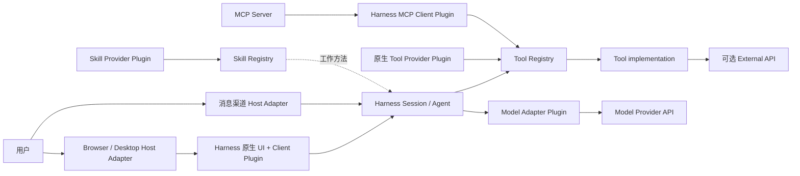

# OpenQuantum 文档与架构入口

这是 OpenQuantum 文档的唯一总入口。第一次接触项目时先读本页；根据任务再进入详细契约、实现地图或审计证据，
不需要从头通读所有架构文件。

## 先记住三个结论

1. **OpenQuantum 是 DeepSeek Harness 的量子科研发行版，不是第二个 Agent Runtime。** Session、Agent loop、
   Tool Registry、Skill Registry、审批、沙箱、模型调用和事件日志都以 Harness 为权威。
2. **Agent 唯一直接调用的执行原语是 Tool。** Skill 提供工作方法；原生 Tool Plugin 或 Harness MCP Client
   把 Tool 注册进 Registry；MCP Server 只是 Tool 的进程外或远程提供方式。
3. **运行完成不等于科学验收通过。** Tool 产生 facts，Materializer 形成可重读证据，Validator 产生
   observations，Acceptance Profile 定义规则，只有 central Acceptance Builder 推导 Acceptance。

## 架构总览

OpenQuantum 的产品核心对象是 **Capability**：用户能够理解的一项有界量子科研能力。Capability 按实际需要
组合 Skill、Tool Provider、科学验证和证据，不会自动创造新的 Runtime 对象。

### 两个正交视角

“四层架构”在本项目中应理解为四个**职责面**，不是 `UI → Harness → 量子扩展 → Model` 的线性调用流水线：

| 职责面 | 拥有什么 | 不拥有什么 |
| --- | --- | --- |
| UI | 展示、输入、用户意图、只读投影 | Session 状态机、模型直连、量子算法、科学判定 |
| Harness | Session、Agent、Registry、Tool 调度、权限、沙箱、事件与持久化 | OpenQuantum 私有量子规则 |
| 量子扩展 | Skill、Tool implementation、可选 Validator 与科研合同 | 第二套 Agent loop、Session 或 Tool Registry |
| Model | Provider Route、协议适配、模型能力、凭据引用 | 量子科学规则、最终 Acceptance |

DeepSeek Harness 的“一切皆 Plugin”是另一个视角：凡是进入 DSH Runtime 的可组合模块，都通过
**Cordis Plugin** 装配、注入 Interface 并随 scope 回收。Plugin 回答“怎样进入 Runtime”；Skill、Tool、
MCP Server、Validator 等职责对象回答“负责什么”。Scientific Validator 和领域算法可以只是 Plugin 内部的
普通模块，不需要为了形式统一而各自成为 Plugin。



这些入口可以启动独立 Host 进程或 Session，但复用同一套 Deployment、Agent Preset、Application Interface 和
领域规则；Host Adapter 不因此成为第二套 Agent Runtime。

### 两条运行链必须分开

```text
用户运行链
User intent -> Harness Session / Agent -> Skill instructions -> Tool Registry
            -> Tool implementation -> tool/result -> Session event log

科学验收链
Tool facts -> Materializer -> materialized Artifact + provenance
                          -> Validator -> observations
Profile + observations + provenance -> central Acceptance Builder -> Acceptance Report
```

Eval 和 Benchmark 属于开发、CI 和发布证据，不进入用户运行链，也不能代替运行时 Validator。

### 不要把不同状态都叫“可用”

| 事实 | 回答的问题 | 权威来源 | 不能证明 |
| --- | --- | --- | --- |
| 配置策略 | 某个 Skill 或 MCP Server 连接是否被配置为加载？ | Agent Preset、Project Settings Interface | Plugin 已激活、Tool 已注册 |
| Runtime readiness | 当前 Host 中 Plugin、Registry 和外部依赖是否真的可达？ | Host/Registry probe、真实 Tool list | 某次任务会成功 |
| 执行状态 | Turn、Goal 或 Job 运行到哪里？ | Harness Session event log | 科学上正确 |
| 科学验收 | 物化证据是否满足版本化规则？ | central Acceptance Builder 生成的 Acceptance Report | Benchmark 表现或独立复现 |
| Capability maturity | 发行版具备 L0–L3 中哪一级开发证据？ | `.agents/capability-packages.yml` + conformance/eval | 当前在线 ready |
| Score / Reproduction | 固定规则评分或独立复现结果是什么？ | 对应版本化报告 | Runtime Completion 或 Scientific Acceptance |

## 新需求应该放在哪里

| 产品需求 | 首选落点 |
| --- | --- |
| 增加知识、步骤、工具选择和解释边界 | Harness 原生 `SKILL.md` |
| 让 Agent 执行一个原子动作 | Tool + Tool Provider |
| 需要独立进程、跨语言或远程部署 | MCP Server + Harness MCP Client |
| 调用厂商 SDK、量子云或数据库 | Tool implementation 内的 External API Adapter |
| 增加模型或切换模型协议 | Deployment 的 Model Provider Route |
| 独立检查科学主张 | Scientific Validator；需要最终验收时再组合 Profile、Materializer 和 central Builder |
| 增加浏览器展示或设置表单 | Harness Client Plugin；已有能力走 Harness RPC，OpenQuantum 特有设置走 Bounded Host Route → Application Interface |
| 接入 Harness hook 或宿主生命周期 | 经过审查的 Host Plugin；只有原生配置不能表达时使用 |
| 检查版本质量或性能 | Eval / Benchmark，不进入生产请求链 |

## 四条贡献路径

| 路径 | 最小组合 | 黄金样板 | 关键验证 |
| --- | --- | --- | --- |
| L0：知识与方法 | Skill | [`quantum-sdk-advisor`](../.agents/skills/quantum-sdk-advisor/SKILL.md) | `npm run capability:conformance` + 真实 `skill.list` 测试 |
| L1：Agent 执行动作 | Skill（当前发行版 policy 要求）+ Tool + Tool Provider | [`qpanda-qubo`](../.agents/skills/qpanda-qubo/) | capability test + `npm run capability:contracts:test` + Registry 测试 |
| L2：可审计 observations | L1 + schema + Validator + eval evidence | [`platform-diagnostics`](../.agents/skills/platform-diagnostics/) | capability/eval + Validator 失败路径测试 |
| L3：可回放科学验收 | L2 + Profile + Result Package + Materializer/重读 + central Builder 接入 | [`quantum-ground-state`](../.agents/skills/quantum-ground-state/) | contract + materialization + Result Commit/Session replay 测试 |

概念上 Tool 不依赖 Skill；当前 OpenQuantum **发行版 Capability Package policy** 为每个登记能力要求同名
`SKILL.md`。这是仓库治理规则，不是 DSH Tool Registry 的限制。新增文件在运行
`npm run capability:conformance` 前需要先暂存，因为该检查只审计 Git 跟踪的发行版内容。

完整操作步骤见[参与贡献](../CONTRIBUTING.md)。

## 配置与代码权威

| 事实 | 权威位置 | 验证 |
| --- | --- | --- |
| 静态模型 Provider catalog | `runtime/openquantum/model-routes.cordis.yml` | Web/Desktop/ACP 组合一致性测试 + model probe |
| 用户模型 Route 覆盖 | Git 忽略的 `$DSH_HOME/settings.yaml` | Web 设置测试 + ACP 本地模型回路测试 |
| Deployment 默认模型、Agent Preset 与 Host 扩展 | `runtime/openquantum/cordis.patch.yml` | `npm run harness:config`、`npm run desktop:check` |
| OpenQuantum Agent 的 Skill/Tool Provider 组合 | `runtime/openquantum/agent-presets/openquantum/agent.cordis.yml` | Harness Registry 集成测试 |
| 发行版 Capability 与 L0–L3 证据引用 | `.agents/capability-packages.yml` | `npm run capability:conformance` |
| Skill 指令与领域资源 | `.agents/skills/<id>/` | Skill discovery、capability test |
| 设置命令和状态转换 | `src/settings/server/project-settings.mjs` | project settings tests |
| 设置页产品目录 | `src/settings/server/project-settings-catalog.mjs` | settings/Web tests |
| 科学合同与最终状态构建 | `.agents/skill-contracts/` + capability Profile/Validator | `npm run test:contracts` + materialization tests |
| 模型与云凭据值 | Git 忽略的 `.env` 或 Harness credential store | 显式 probe；不得进入 Git |

## 按任务阅读

### 使用 OpenQuantum

- [部署与启动](DEPLOYMENT.md)：本地、Docker、模型配置和启动检查。
- [常见问题与故障排查](TROUBLESHOOTING.md)：按 UI、模型、MCP Server、凭据和 Docker 分层定位。
- [消息渠道接入](integrations/CC_CONNECT.md)：通过 CC Connect 和 ACP 接入微信、飞书等平台。
- [项目首页](../README.md)：产品能力、已集成工具和快速开始。

### 二次开发

- [参与贡献](../CONTRIBUTING.md)：L0/L1/L3 最小路径、文件清单和验证要求。
- [扩展对象模型](architecture/EXTENSION_MODEL.md)：对象职责、选择规则和禁止依赖。
- [模块地图](architecture/MODULES.md)：模块 Interface、依赖方向和代码落点。
- [仓库地图](REPOSITORY_GUIDE.md)：目录职责、配置权威和实际编排关系。
- [量子能力候选清单](ecosystem/QUANTUM_CAPABILITY_CATALOG.md)：当前集成和后续候选。

### 架构证据与决策

- [领域语言](../CONTEXT.md)：唯一的产品与科研术语表，不放实现细节。
- [架构审计与证据基线](architecture/ARCHITECTURE_AUDIT.md)：日期化结论、证据、风险和待办。
- [ADR-002：Harness 原生扩展优先](architecture/ADR-002-HARNESS-NATIVE-EXTENSIONS-FIRST.md)：当前有效。
- [ADR-003：Desktop 作为 Host Adapter](architecture/ADR-003-DESKTOP-AS-HARNESS-HOST-ADAPTER.md)：当前有效。
- [ADR-001：知情审批默认拒绝](architecture/ADR-001-INFORMED-APPROVAL-FAIL-CLOSED.md)：历史记录，已由 Harness 原生审批机制取代，不是当前实现契约。
- [MVP 历史开发计划](roadmap/DEVELOPMENT_PLAN.md)：历史路线；当前事实以配置、测试和架构审计为准。

## 文档职责与冲突处理

不同问题使用不同权威，不把所有文档排成一条模糊的优先级：

- **当前运行事实**：实际 Cordis 配置、Harness Registry 和自动测试；
- **领域术语**：`CONTEXT.md`；
- **扩展职责与选择规则**：`EXTENSION_MODEL.md`；
- **模块 Interface 与依赖方向**：`MODULES.md`；
- **日期化健康结论与风险**：`ARCHITECTURE_AUDIT.md`；
- **难以逆转的设计取舍**：状态为“已接受”的 ADR；
- **未来计划**：Roadmap，只表示意图，不证明已经实现。

如果规范与实现不一致，应把它记录为架构偏差并修复，而不是静默选择其中一份继续开发。
