# OpenQuantum 架构审计与证据基线

- 状态：日期化审计证据；不是长期架构定义入口
- 日期：2026-09-01
- 上游：DeepSeek Harness `0.1.0-rc.6`（已审阅 `0.1.1-rc.2`，等待匹配的可安装 Desktop Host Adapter 包）

稳定的架构总览与文档权威见[文档与架构入口](../README.md)；扩展职责见
[扩展对象模型](EXTENSION_MODEL.md)，模块依赖见[模块地图](MODULES.md)。本文件只记录本次审计时点的
结论、证据、风险和后续动作，不与这些长期契约竞争。

## 1. 结论

OpenQuantum 是 DeepSeek Harness 的开源量子科研发行版，不是新的 Agent Runtime。

产品按四个职责面归属规则；它们不是一条线性调用链：

1. **UI**：展示 Harness 会话、交互、工具调用和科研结果；
2. **Harness**：提供 Session、Agent、Turn、Goal、Job、Tool Registry、Skill Registry、Harness MCP Client、
   Host Plugin、Client Plugin、权限、沙箱、模型和持久化；
3. **量子扩展内容**：独立的 Harness Skill、Tool Provider 与 OpenQuantum Scientific Validator；Harness MCP
   Client 是一种 Tool Provider，MCP Server 通过协议暴露 Tool，eval/benchmark 只属于开发证据；
4. **Model**：通过 Harness Provider route 提供推理和 Tool Calling。

核心原则是：

> Harness 已经提供的通用机制不重做；量子差异优先实现为原生 Skill、Tool Provider 或经过审查的 Host Plugin。

这与 DeepSeek Harness 的“一切皆 Plugin”完全一致：Cordis Plugin 是所有可组合模块进入 Runtime 的统一装配和
生命周期机制；Skill、Tool、MCP Server、Validator 等名称描述的是模块职责。Plugin 回答“怎样接入和存活”，
职责对象回答“负责什么以及必须满足什么 Interface”，两者不可互相替代。

OpenQuantum 不建设私有插件市场、包管理器、安装锁、可安装扩展 Catalog、第二套权限系统或平行事件日志。
量子公司通过 Fork、普通 Git/npm/pip 依赖和 Harness 原生扩展点维护自己的发行版。

### 1.1 本轮审计结论

本轮按业务对象、依赖方向、配置权威、真实 Harness 组合和测试 surface 审计，而不是按目录数量判断架构。
结论是：**四个职责面的边界成立，可以继续在现有架构上开发；本轮已用扩展对象模型和 capability policy 1.1
正式管理术语与执行入口，下一阶段重点是继续提升能力包成熟度，而不是增加新的 Runtime。**

| 审计项 | 结论 | 证据或处理 |
| --- | --- | --- |
| Harness 是唯一通用 Runtime | 通过 | 真实临时 Host 完成 `host.describe`、双 Session、Skill discovery、Tool Registry 与模型目录检查 |
| UI 不直连 Model Provider、MCP Server 或 Skill 文件系统 | 通过 | 原生 Web UI + Client Plugin；设置写入只进入服务端 Interface |
| Skill、Tool Provider、Validator 权责分离 | 通过 | Agent Preset 组合 Skill Provider、Tool Provider 与必要的 agent-scoped Host Plugin；Tool、Materializer 或 CI 显式调用 Validator；policy 按等级引用执行入口及相应 contract/eval 证据 |
| 执行事实与科学验收分离 | 通过 | Harness event log 与 Result/Acceptance/Score/Reproduction 合同正交 |
| 设置模块职责 | 已改善 | HTTP route 只处理传输边界；统一 Settings Interface 拥有 setup/凭据门控、CAS、路径安全和原子写入，静态 Catalog 独立只读 |
| Capability Package 一致性 | 通过（静态声明） | L0–L3 policy 已绑定 Git 跟踪的 Skill、Agent Preset Provider/activation 声明、Tool contract、合同检查入口、最大副作用及其证据来源、科学合同、依赖锁和物化证据 |
| 科研结果物化 | 通过 | QGS 与 QI 两条 L3 capability flow 复用同一 Materializer、内部 Adapter Registry 和有界投影协议 |
| 在线模型可用性 | 缺少当前 ready evidence | 发布前必须重新运行带目标 Provider 的文本生成与 Tool Calling 探针；历史报告不能替代当前检查 |

Skill、Tool、MCP Server、Harness MCP Client、External API 等对象的严格定义见[扩展对象模型](EXTENSION_MODEL.md)，长期模块边界、
依赖方向和新增能力落点见[模块地图](MODULES.md)。仓库内
[`evidence/platform-diagnostics-2026-08-24.json`](evidence/platform-diagnostics-2026-08-24.json) 是
2026-08-24 的历史基线；其 `degraded` 只说明当时无凭据环境没有运行在线模型检查，不能证明当前
在线就绪状态，也不表示静态架构失败。

## 2. 当前事实

仓库已经具备：

- 固定版本的 DeepSeek Harness Web Host；
- 与同一 Harness Home 组合的可选 DSH Desktop 原生宿主；
- 项目级 OpenQuantum Agent preset 和模型 Provider route；
- Harness 原生 Session 创建、历史、Prompt、取消、审批和问题响应；
- `events.mux` / `events.host` 双流、重连和 history 重基线；
- 通过 Harness 官方扩展点注册的 OpenQuantum 品牌、设置和科研展示；
- 项目 Skill 根 `.agents/skills`；
- `platform-diagnostics` 诊断 Skill；
- `quantum-ground-state` 量子基态 Skill；
- `quantum-information-audit` 独立量子信息 Validator 与 eval evidence；
- Qiskit、FieldQKit、QPanda QUBO、MQT QCEC、Stim/PyMatching 与 TyxonQ 等有界 Skill 和 MCP Server-backed Tool 能力；
- QMClaw 超导量子比特调校 Skill，以及覆盖 13 类实验、固定为合成数据的原生 Tool 能力；
- 共享原生 Tool Provider 注册 QGS 与 QMClaw Tool；其余跨语言、独立进程和远程 Tool 由 Harness MCP Client 注册；
- 默认关闭、固定源码 commit 且由设置中心做凭据/安装门控的社区量子硬件 MCP Server。

DeepSeek Harness 仍处于 Developer Preview，因此上游接口可能发生破坏性变化。OpenQuantum 通过固定版本、
真实端到端测试和少量 Adapter 隔离这种变化；不应因此复制 Harness 的状态机。

## 3. 权威对象映射

| 产品概念 | 权威实现 | OpenQuantum 是否另建对象 |
| --- | --- | --- |
| 科研会话与历史 | Harness `Session` + `SessionEvent` | 否 |
| 一次用户交互 | Harness `Turn` / `Step` | 否 |
| 长期目标与后台任务 | Harness `Goal` / `Job` | 否 |
| Agent 执行循环 | Harness Agent Runtime | 否 |
| Skill 发现与加载 | Harness Skill registry | 否 |
| Agent-facing Tool | Harness Tool Registry | 否 |
| MCP Server 连接与 Tool 注册 | Harness MCP Client | 否 |
| Cordis Plugin 组合与生命周期 | Harness Cordis Plugin 系统 | 否；Host、Client、Skill Provider、Tool Provider、MCP Client 和 Model Adapter 是不同职责角色 |
| 审批、权限和沙箱 | Harness policy / approval / sandbox | 否 |
| 模型调用 | Harness Provider route / Model Adapter | 否 |
| 持久化、回放与恢复 | Harness Session event log | 否 |
| 量子工作流与解释边界 | Harness Skill | 是，作为模型指令内容 |
| 确定性科学计算 | OpenQuantum Tool（原生或由 MCP Server 暴露） | 是，作为工具实现 |
| 科学验收 | Validator observations + versioned Profile + central Acceptance Builder | 是；Materializer 把重读后的结构化证据交给 Validator，Builder 再统一推导 |

`Experiment`、`Artifact`、`Provenance` 和 `Scientific Acceptance` 是对 Harness 执行事实的科研解释，
不是新的 Runtime 状态机。

## 4. 四个职责面

### 4.1 UI

UI 拥有布局、输入和只读投影。它可以发出新建、发送、取消、审批等用户意图，但不直接调用 Model Provider、
MCP Server 或 Skill 文件系统，不保存第二份 Session 历史，也不推导科学通过状态。

默认产品界面直接使用 DeepSeek Harness 原生 Web UI，通过它的 Client Plugin、Slot、Settings 和
`tapIndex` 扩展点组合 OpenQuantum 品牌与量子科研展示。这样 Session、审批、模型、设置和插件界面
继续由 Harness 自己维护，不在 OpenQuantum 中复制一套平行状态机。

可选 Desktop 入口以 DSH Desktop 作为产品层的 Host Adapter，承载同一套原生 Web UI。其实现可以由上游
Cordis Plugin 组合，但产品职责只覆盖桌面进程、窗口、托盘、终端和原生通知生命周期；它不拥有
Session/Agent 生命周期，也不是 OpenQuantum 的领域 Host Plugin。loopback HTTP/WebSocket、Session event log、
Agent loop、插件组合与科研状态仍由同一个 Harness Host 管理。OpenQuantum 不读取 Electron 私有接口，也不建立
Desktop 专用 Session 投影。

OpenQuantum 不保留独立的浏览器应用、Session 投影或事件 Transport Adapter。品牌通过 `tapIndex` 注入，
量子设置与科研展示通过 Harness Client Plugin、Slot 和 Settings 扩展。新增 Goal、Job、Skill、Model 或
量子算法行为时，必须继续使用 Harness 原生 UI/扩展点或向上游贡献，不能重新复制 Runtime 状态。

### 4.2 Harness

Harness 是通用执行权威，拥有：

- Session、Turn、Step、Goal、Job 生命周期；
- append-only 事件日志、持久化、回放、恢复和分叉；
- Agent loop、Prompt 组装、上下文压缩和 Tool Calling；
- Skill Registry、Tool Registry、Harness MCP Client、Host Plugin、Client Plugin 和 Model Registry；
- 审批、权限、沙箱、文件、子进程、超时和取消；
- HTTP RPC 与 WebSocket 事件协议。

OpenQuantum 只通过 `runtime/openquantum/` 中的 patch/preset 组合这些能力，不修改 `node_modules`，也不把
Harness 通用职责搬进应用代码。

这里的组合单元统一是 Cordis Plugin row。Skill Provider Plugin、Tool Provider Plugin、Harness MCP Client
Plugin、Model Adapter Plugin、Host Plugin 和 Client Plugin 共享同一装配机制，但它们注册的 Interface、
权限和产品职责不同。不能因为技术上都是 Plugin，就把它们合并成一个无边界的 OpenQuantum Plugin。

### 4.3 量子扩展内容

DeepSeek Harness 在这里提供彼此独立的 seam：

下表按职责区分模块；这些职责需要进入 Harness 时，仍由对应 Cordis Plugin row 装配。

| 模块 | Harness Interface | 职责 | 不负责 |
| --- | --- | --- | --- |
| Skill | `ctx.skills` / `skill` Tool | 发现并加载名称、描述、Markdown 指令和资源基址 | 启动 MCP Server、注册 Tool、执行 Validator |
| Model-facing Tool | `ctx.tools` | Agent 可调用的原子动作；声明 schema、错误语义和副作用 | 管理 Session、充当 Skill 或直接宣布最终 Acceptance |
| MCP Server | MCP 协议 | 通过 stdio 或 Streamable HTTP 暴露 Tool、Resource 或 Prompt | 注册 Harness Tool、加载 Skill、管理 Session |
| Harness MCP Client | `ctx.tools` | 连接 MCP Server，将 Tool 注册为 `mcp__<server>__<tool>`，管理超时与重连 | 理解领域工作流、替 MCP Server 执行算法、替代 Tool 合同 |
| External API Adapter | Tool implementation | 在 Tool 后访问厂商 API、SDK、数据库或量子云 | 直接暴露给 UI/Skill、充当 Agent 执行原语 |
| Agent Preset | Agent scope 组合配置 | 挂载 persona、Skill Provider、原生 Tool Plugin、Harness MCP Client、策略与必要的 agent-scoped Host Plugin | 配置 Provider Route、创造 Skill→MCP 绑定协议 |
| Deployment/Home Patch | Host scope 组合配置 | 配置 Provider Route、默认模型/Preset、deployment-scoped Host Plugin 和 Client Plugin | 实现领域算法或科学阈值 |

Scientific Validator 不是 Harness Skill Registry 的子模块，必须由 Tool、Materializer 或 CI 显式调用；
它只产生 observations。当起点是 Harness hook 时，可信 Host Plugin 拥有 hook，其内部
Scientific Result Adapter 只负责 capability 映射。Acceptance Profile 是版本化规则数据，central
Acceptance Builder 汇聚 Profile、observations 和 provenance 后推导最终验收。Eval/benchmark 是开发与发布
证据，不进入用户请求的运行链。模型加载 Skill 不会自动执行 Validator。

#### Harness Skill

Harness 原生入口是 `.agents/skills/<skill-name>/SKILL.md`。同目录可以包含：

```text
.agents/skills/<skill-name>/
├── SKILL.md                 # Harness 原生入口和工作流
├── agents/openai.yaml       # 可选的跨 Agent UI 元数据；Harness filesystem provider 不读取
├── references/             # 领域约定和作用域
├── inputs/                 # 输入 schema
├── scripts/                # 确定性本地实现
├── validators/             # 科学检查
├── evals/                  # 固定回归案例
├── artifacts/              # 科研产物 schema
└── capability.yaml         # 可选的仓库科学元数据
```

`capability.yaml`、Acceptance Profile、Result/Report schema 是 OpenQuantum 的科研合同约定，用来组织并测试
科学证据。它们不是 Harness Skill 字段、插件安装协议或 Skill→MCP 绑定，也不会取代 Harness 的 Skill
Registry、Harness MCP Client、权限或持久化。

`SKILL.md` 是模型指令，不能独自强制安全或科学正确性。必须强制的规则放在 Tool 输入校验、确定性
Validator 或可信 Host Plugin 中，并由 Harness 调用。

把 MCP Server、Validator、schema 或 eval 源码放在同一 `.agents/skills/<name>/` 目录只是一项 locality 约定：
相关科学知识可以一起审查和版本化。连接 MCP Server 的 Client 仍需在 Agent Preset 中独立声明，Validator
仍需由 Tool、Materializer 或 CI 显式调用。内部 Scientific Result Adapter 不拥有 Harness hook；hook 由
可信 Host Plugin 拥有。
同理，`agents/openai.yaml` 可以服务其他 Agent/Codex 客户端，但不能作为 DeepSeek Harness 的 Skill 配置或
依赖声明；Harness filesystem provider 的权威入口仍是 `SKILL.md` frontmatter 与正文。

### 4.4 Model

Model 层只拥有 Provider、模型、Endpoint、凭证引用和推理能力差异。Skill 可以描述需要 Tool Calling，
但不能读取 Provider 凭证；UI 也不能直接调用模型。真实密钥只保存在被 Git 忽略的环境文件或 Harness
credential store。

## 5. 原生扩展选择

以下列表用于判断一项 Capability 真正需要哪些职责对象和 Interface，不是在 Plugin 与非 Plugin 之间二选一。
凡是需要进入 Harness Runtime 的能力，最终仍由职责明确的 Cordis Plugin row 装配。

从最小产品需求开始，只增加真实需要的对象；这不是每项能力都必须走完的固定流水线：

1. **Skill**：仅在需要领域知识、步骤、边界和工具使用说明时增加；
2. **Tool**：需要 Agent 执行动作时，先定义最小 schema、错误语义和副作用；
3. **MCP Server**：Tool 需要独立进程、语言无关协议或远程部署时才使用；
4. **Scientific Validator**：存在可验证科学主张时增加，由 Tool、Materializer 或 CI 调用并产生 observations；
5. **Acceptance Profile**：以版本化数据定义作用域、阈值和必选 observations；
6. **central Acceptance Builder**：唯一地消费 Profile、observations 与 provenance 并推导 Acceptance；
7. **Agent Preset**：组合 Skill Provider、Tool Provider、Agent 策略和必要的 agent-scoped Host Plugin；
8. **Deployment/Home Patch**：组合 Provider Route、默认项、deployment-scoped Host Plugin 和 Client Plugin；
9. **Host Plugin**：只有原生配置不能表达宿主行为时才使用，并按 hook 所有者明确 scope。

`dsh-plugin` 与仓库内 stdio MCP 都是可信宿主代码，必须在 Fork 中显式审查和锁定依赖。第一版不从远程
自动安装用户提供的命令、Cordis patch 或插件。

## 6. QGS 参考纵切

首个参考流程是：

```mermaid
flowchart LR
  A["用户提供二量子位 Pauli Hamiltonian"] --> B["Harness Session / Agent"]
  B --> C["加载 quantum-ground-state Skill"]
  C --> D["调用原生 Tool solve_and_validate_ground_state"]
  D --> E["六类结构化事实"]
  D --> F["Tool 内计算级 Validator（执行期）"]
  F --> G["执行期 observations；provenance not_checked"]
  G --> H["可信 Host Plugin 调用内部 Scientific Result Adapter"]
  H --> I["Materializer 使用 ctx.fs 物化、重读和校验 Result Package"]
  I --> J["物化证据 Validator（来源链复核）产生 observations"]
  J --> L["Profile + observations + provenance 汇入 central Acceptance Builder"]
  L --> M["Builder 派生 Acceptance"]
  M --> K["tool/result 持久化 Result Commit；UI 回放"]
```



图中的两次 Validator 调用处于不同证据阶段：Tool 内调用只能形成计算级 observations，并明确保留
`provenance.not_checked`；物化后再次基于重读字节复核，所得 observations 才能与 Profile、provenance 一起
交给 central Acceptance Builder。二者都不能自行宣布最终 Acceptance。

QGS 与 QMClaw 都是进程内纯 JavaScript，因此由共享的 OpenQuantum 原生 Tool Provider 直接注册；不再为本地
Module 增加 stdio MCP 进程。跨语言 Python、独立进程与远程服务仍使用 MCP Server + Harness MCP Client。

Harness Tool Registry 将原生 Tool 的 canonical value 保留在执行期，而 Session log 持久化 model-facing
`tool/result` content。OpenQuantum 使用一个仓库内可信 Host Plugin 拥有官方
`tools/post-execute` hook；Plugin 查询内部 Scientific Result Adapter Registry。Adapter 映射该 Tool 的输入、
Artifact 类型、Materializer 和 Validator；Materializer 通过 `ctx.fs` 原子写入并重读真实字节，
Validator 只接收重读后的结构化证据，central Acceptance Builder 再消费 Profile、observations 和
provenance。Plugin 只把有界 Result Commit/展示投影放回原生 `tool/result`，不接管 Tool Provider 生命周期、
不另存 Session，也不新增自定义事件类型。Scientific Result Adapter 不是可独立安装的 Tool Provider。

Solver 只产生事实；Validator 只产生作用域和逐项 observation。总体科学验收必须由版本化 Profile 和
central Acceptance Builder 推导，模型、Tool 成功或 Harness idle 都不能自行宣称“科学通过”。

普通调用使用组合 Tool 是为了隐藏跨 Tool 的大型 bundle 编排，而不是合并科学职责：内部 Solver 和 Validator
仍是独立模块。原子 Tool 返回的执行期观察仍固定 `provenance.complete=not_checked`；只有
Materializer 物化、重读并校验真实 Result Package，Validator 对重读后的结构化证据产生 observations，
central Acceptance Builder 才能消费 Profile 与 provenance 派生最终 Acceptance。facts-only 与
materialized-validation 保持内部 solver/Validator Interface，不增加模型可见 Tool。

## 7. 状态不变量

执行、科学验收、评分和复现是正交事实：

| 维度 | 示例状态 | 权威来源 |
| --- | --- | --- |
| 执行 | pending / running / idle / failed / cancelled | Harness events |
| 科学验收 | not_evaluated / passed / conditional / failed | Validator observations + Profile + central Builder |
| 评分 | unscored / invalid / valid | OpenQuantum eval runner |
| 复现 | not_attempted / reproduced / not_reproduced | 独立复现证据 |

必须始终满足：

1. UI 不持有密钥，也不直接调用 Model Provider、MCP Server 或 External API；
2. Session log 是执行事实的唯一来源；
3. Runtime 完成不等于科学验收通过；
4. 模型只能解释 Validator observations 和 Acceptance，不能改写它们；
5. 有副作用或付费操作仍通过 Harness Tool、权限和审批；
6. Skill 加载、Tool Provider 注册、Harness MCP Client 连接或 Tool 调用失败必须形成可观察失败，不能降级为模型猜测；
7. 新增量子场景按需增加独立 Skill、Tool Provider 和 Validator；Agent Preset 组合 Skill Provider、
   Tool Provider，以及确有需要的 agent-scoped Host Plugin；Tool 或 Materializer 显式调用 Validator，
   不修改 Harness 核心；
8. 更换模型 Provider 不修改量子科学规则。

## 8. 部署与依赖方向

第一阶段是共享 Harness Home 的本地 Host：

```text
Browser ───────────────────────────────┐
DSH Desktop (optional Electron shell) ─┤
                                      └── DeepSeek Harness native Web UI + OpenQuantum branding/plugins
                                            └── DeepSeek Harness Host (loopback)
                                                  ├── Deployment/Home Patch → model provider routes
                                                  └── OpenQuantum Agent Preset
                                                      ├── native project Skills
                                                      ├── native Tool Providers → Tools
                                                      └── Harness MCP Client → MCP Server → MCP-exposed Tools
```

Web 与 Desktop 是同一产品组合的两个 Host Adapter，读取同一个 `.openquantum/dsh`。Host Adapter
是产品入口，不是装载 Harness 生命周期代码的 Host Plugin。本地单用户模式不同时
启动两个 Host 写入同一 Session 状态。Desktop 版本必须与固定的 Harness family 对齐，并通过 headless
组合检查后才能升级。

禁止依赖：UI → Model Provider、UI → MCP Server、UI → External API、UI → Skill 文件系统、Skill → UI、Skill → Provider 凭证、
Model → Skill，以及任何层绕过 Harness 伪造 Session 执行事件。

生产部署如果公开给不受信任用户，必须把 Harness 与本地 MCP Server 进程放进受控 Worker/容器，并单独审计身份、
workspace、网络、进程和凭证隔离；本地开发配置不能被误称为多租户安全边界。

## 9. 版本与贡献策略

- DeepSeek Harness 与 MCP SDK 使用锁定版本；
- DSH Desktop 与 Harness family 成对锁定，桌面上游升级不得绕过 Harness 兼容性检查；
- OpenQuantum 通过普通 Git commit、tag 和 lockfile 发布；
- 量子公司通过 Fork 增加自己的 Skill、Tool Provider、Agent Preset 或可信 Host Plugin；
- 通用 Runtime 修复优先贡献给 DeepSeek Harness 上游；
- 科学差异和企业后端留在对应 Fork、Skill、Tool Provider 与必要的 MCP Server；
- 没有多个真实贡献者提出跨 Fork 分发需求前，不设计私有市场或安装系统。

## 10. 当前架构验收基线

每次架构级变更需要持续证明：

- Harness 原生 Skill registry 能发现并加载 `quantum-ground-state`；
- Harness Tool Registry 能列出并调用求解与验证 Tool；
- 非法输入、低预算和篡改结果走确定性失败/observation 路径；
- UI 输入最终进入真实 Harness Session，而不是 Mock Runtime；
- Runtime 与 Scientific 状态分开展示；
- 关闭并重启 Harness 后，Session 可由原生事件日志恢复；
- 一个新开发者能按文档增加独立的 Skill、Tool Provider 或 Validator；Agent Preset 组合 Skill Provider、
  Tool Provider 与必要的 agent-scoped Host Plugin，Tool、Materializer 或 CI 显式调用 Validator，而无需修改
  Harness 核心。

首条 MVP 的历史实施顺序见 [`../roadmap/DEVELOPMENT_PLAN.md`](../roadmap/DEVELOPMENT_PLAN.md)。

## 11. 主要风险

| 风险 | 当前控制 |
| --- | --- |
| Harness Developer Preview 发生破坏性变化 | 固定版本、少量原生扩展、真实 E2E、优先上游修复；`0.1.1-rc.2` 已进入升级候选但不绕过安装合同 |
| Desktop 与 Harness 版本错配 | 成对固定版本、Home patch 组合测试、升级时重跑完整平台检查；GitHub Desktop `2.0.2+` 已适配新 Harness，但对应 `dsh-plugin-desktop` npm 包尚未发布，因此当前保持 `rc.6`/`2.0.0` 同族而不制造双 Runtime |
| LLM 产生科学幻觉 | Tool 产数值、Validator 产 observations、Profile 提供规则、central Acceptance Builder 推状态、模型只解释 |
| Skill 作用域过度承诺 | supported/out-of-scope、schema、正负例和篡改测试 |
| MCP Server/Host Plugin 获得宿主权限 | 仓库内可信代码、依赖锁定、显式配置、代码审查 |
| 社区硬件 MCP Server 提交真实云任务 | 默认关闭、固定到已审阅的 `83d1b92`、显式安装与启用、Harness 凭据引用、最小权限云账户；候选点的连接拓扑、设备状态、漂移门禁与 stabilizer 离线回归已验证，未追随后续共享数据库/qforge 扩张 |
| 凭证或科研数据泄露 | 服务端环境引用、同源白名单、Artifact 秘密扫描 |
| Client Plugin 演化成第二套 Runtime | 冻结业务范围，只做展示与配置扩展，通用能力回到 Harness 上游 |
| 能力数量增长导致包结构和声明失真 | 使用 L0–L3 开发成熟度、标准 package 形态和 capability conformance 检查 |

## 12. 后续开发顺序

1. **能力包 conformance（已完成）**：`npm run capability:conformance` 只读验证 Git 跟踪的 `SKILL.md`、
   Agent Preset 中的 Harness MCP Client 与原生 Tool Plugin 声明、activation、Tool contract、合同检查入口、
   `capability.yaml`、依赖锁、测试证据和 L3 物化 Adapter。其 report scope 是 `static-declaration`；
   `npm run check` 另行执行本地合同测试。
2. **第二条 L3 纵切（已完成）**：`quantum-information-audit` 已进入 Harness workspace 物化、真实字节重读、
   中央 Acceptance 与 `tool/result` 回放；QGS 与 QI 通过 Scientific Result Adapter Registry 组合。
3. **Harness 成对升级（受上游发布阻塞）**：`0.1.1-rc.2` 及 Desktop `2.0.2` 源码/安装包已经审阅，但 npm 只提供
   `dsh-plugin-desktop@2.0.0`，其内部固定 `0.1.0-rc.6`。等待或推动上游发布匹配的可安装 Host Adapter 包后，保持
   Web、Desktop、preset 和 Tool seam 同一版本族，并通过 config、Host、Skill、Harness MCP Client、MCP Server、UI
   和 Session 恢复测试再升级锁文件；禁止使用 `--force`、依赖 override 或双版本 Runtime 绕过该合同。
4. **在线证据门**：在有受控 Provider 凭据的 CI/发布环境运行文本生成、Tool Calling 和 QGS/QI E2E；无凭据环境
   继续明确输出 `not_checked`，不阻塞纯离线单元测试，也不伪造 ready。
5. **硬件写操作治理**：FieldQKit 继续只读发现；任何真实 QPU 提交能力必须默认关闭、展示成本与副作用，
   并经过 Harness approval、凭据隔离和单独的集成测试。

后续按“先成对升级基础设施并补在线证据，再谨慎扩大副作用面”的顺序推进。
