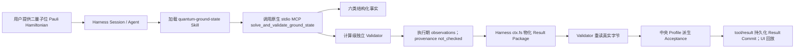

# OpenQuantum 架构审计与 Harness-first 目标设计

- 状态：当前架构基线
- 日期：2026-08-14
- 上游：DeepSeek Harness `0.1.0-rc.6`

## 1. 结论

OpenQuantum 是 DeepSeek Harness 的开源量子科研发行版，不是新的 Agent Runtime。

产品保持四层：

1. **UI**：展示 Harness 会话、交互、工具调用和科研结果；
2. **Harness**：提供 Session、Agent、Turn、Goal、Job、Tool、Skill、MCP、Plugin、权限、沙箱、模型和持久化；
3. **Skill**：保存量子问题的作用域、工作流、科学产物、Validator 和 eval；
4. **Model**：通过 Harness Provider route 提供推理和 Tool Calling。

核心原则是：

> Harness 已经提供的通用机制不重做；量子差异优先实现为原生 Skill、MCP 或经过审查的 `dsh-plugin`。

OpenQuantum 不建设私有插件市场、包管理器、安装锁、Catalog、第二套权限系统或平行事件日志。
量子公司通过 Fork、普通 Git/npm/pip 依赖和 Harness 原生扩展点维护自己的发行版。

## 2. 当前事实

仓库已经具备：

- 固定版本的 DeepSeek Harness Web Host；
- 项目级 OpenQuantum Agent preset 和模型 Provider route；
- Harness 原生 Session 创建、历史、Prompt、取消、审批和问题响应；
- `events.mux` / `events.host` 双流、重连和 history 重基线；
- 一个隔离预览版协议变化的薄 UI Adapter；
- 项目 Skill 根 `.agents/skills`；
- `platform-diagnostics` 诊断 Skill；
- `quantum-ground-state` 量子基态 Skill；
- 通过 Harness 原生 MCP client 注册的本地量子求解与验证工具。

DeepSeek Harness 仍处于 Developer Preview，因此上游接口可能发生破坏性变化。OpenQuantum 通过固定版本、
真实端到端测试和少量 Adapter 隔离这种变化；不应因此复制 Harness 的状态机。

## 3. 权威对象映射

| 产品概念 | 权威实现 | OpenQuantum 是否另建对象 |
| --- | --- | --- |
| 科研会话与历史 | Harness `Session` + `SessionEvent` | 否 |
| 一次用户交互 | Harness `Turn` / `Step` | 否 |
| 长期目标与后台任务 | Harness `Goal` / `Job` | 否 |
| Agent 执行循环 | Harness Agent Runtime | 否 |
| Skill 发现与加载 | Harness Skill registry | 否 |
| Tool、MCP、Plugin | Harness registry / MCP client / Cordis | 否 |
| 审批、权限和沙箱 | Harness policy / approval / sandbox | 否 |
| 模型调用 | Harness Provider route / Model Adapter | 否 |
| 持久化、回放与恢复 | Harness Session event log | 否 |
| 量子工作流与科学规则 | OpenQuantum Skill | 是，作为领域内容 |
| 确定性科学计算 | OpenQuantum MCP / Tool | 是，作为工具实现 |
| 科学验收 | Skill Validator | 是，作为领域规则 |

`Experiment`、`Artifact`、`Provenance` 和 `Scientific Acceptance` 是对 Harness 执行事实的科研解释，
不是新的 Runtime 状态机。

## 4. 四层职责

### 4.1 UI

UI 拥有布局、输入和只读投影。它可以发出新建、发送、取消、审批等用户意图，但不直接调用 Model、
MCP 或 Skill 文件系统，不保存第二份 Session 历史，也不推导科学通过状态。

当前 Next.js UI 通过 `HarnessUiPort` 访问生产 Adapter：

```ts
interface HarnessUiPort {
  snapshot(): Promise<WorkspaceSnapshot>
  command(command: UiCommand): Promise<CommandReceipt>
  events(afterRevision: number | null, signal: AbortSignal): AsyncIterable<UiEvent>
}
```

这个 Adapter 只负责同源安全边界、协议翻译、事件折叠、重连和历史重基线。新增 Goal、Job、Skill、Model
或量子算法行为时，应优先使用 Harness 原生 UI/扩展点或向上游贡献，而不是继续把 Runtime 状态复制进 Adapter。

### 4.2 Harness

Harness 是通用执行权威，拥有：

- Session、Turn、Step、Goal、Job 生命周期；
- append-only 事件日志、持久化、回放、恢复和分叉；
- Agent loop、Prompt 组装、上下文压缩和 Tool Calling；
- Skill、Tool、MCP、Plugin 和 Model registry；
- 审批、权限、沙箱、文件、子进程、超时和取消；
- HTTP RPC 与 WebSocket 事件协议。

OpenQuantum 只通过 `runtime/openquantum/` 中的 patch/preset 组合这些能力，不修改 `node_modules`，也不把
Harness 通用职责搬进应用代码。

### 4.3 Skill

Harness 原生入口是 `.agents/skills/<skill-name>/SKILL.md`。同目录可以包含：

```text
.agents/skills/<skill-name>/
├── SKILL.md                 # Harness 原生入口和工作流
├── references/             # 领域约定和作用域
├── inputs/                 # 输入 schema
├── scripts/                # 确定性本地实现
├── validators/             # 科学检查
├── evals/                  # 固定回归案例
├── artifacts/              # 科研产物 schema
└── capability.yaml         # 可选的仓库科学元数据
```

`capability.yaml`、Acceptance Profile、Result/Report schema 是 OpenQuantum 的科研合同约定，用来组织并测试
科学证据。它们不是插件安装协议，也不会取代 Harness 的 Skill registry、MCP client、权限或持久化。

`SKILL.md` 是模型指令，不能独自强制安全或科学正确性。必须强制的规则放在 Tool/MCP 输入校验、确定性
Validator 或可信 `dsh-plugin` 中，并由 Harness 调用。

### 4.4 Model

Model 层只拥有 Provider、模型、Endpoint、凭证引用和推理能力差异。Skill 可以描述需要 Tool Calling，
但不能读取 Provider 凭证；UI 也不能直接调用模型。真实密钥只保存在被 Git 忽略的环境文件或 Harness
credential store。

## 5. 原生扩展选择

按从轻到重的顺序选择扩展点：

1. **Skill**：领域知识、步骤、边界和工具使用说明；
2. **MCP**：确定性计算、科学后端、数据库或外部服务；
3. **preset / Cordis 配置**：组合 Agent、Skill、MCP、权限和模型 route；
4. **`dsh-plugin`**：只有原生配置不能表达宿主行为时才使用。

`dsh-plugin` 与仓库内 stdio MCP 都是可信宿主代码，必须在 Fork 中显式审查和锁定依赖。第一版不从远程
自动安装用户提供的命令、Cordis patch 或插件。

## 6. QGS 参考纵切

首个参考流程是：



MCP server 使用官方 Model Context Protocol SDK，Harness 通过 `@deepseek-ai/dsh-mcp-client` 管理 stdio
进程、Tool registry、超时和重连。MCP 不管理 Session，不读取模型密钥，不写任意文件。

官方 MCP bridge 将完整 `structuredContent` 保留为 Tool pipeline 的执行期 value，而 Session log 持久化
model-facing `tool/result` content。OpenQuantum 在官方 `tools/post-execute` 接缝使用一个仓库内可信 Adapter：
它通过 Harness `ctx.fs` 把 input、六类 Artifact 和合同文件原子写入 Session workspace，调用独立 Validator
与中央 Acceptance builder，并只把有界 Result Commit/展示投影放回原生 `tool/result`。它不接管 MCP 生命周期、
不另存 Session，也不新增自定义事件类型。未来 Harness 若原生支持等价的结构化 Artifact commit，这个 Adapter
应继续收缩或上游化。

Solver 只产生事实；Validator 只产生作用域和逐项 observation。总体科学验收必须由版本化 Profile 和中央
builder 推导，模型、MCP 成功或 Harness idle 都不能自行宣称“科学通过”。

普通调用使用组合 Tool 是为了隐藏跨 Tool 的大型 bundle 编排，而不是合并科学职责：内部 Solver 和 Validator
仍是独立模块。MCP 返回的执行期观察仍固定 `provenance.complete=not_checked`；只有 Harness Adapter 物化真实
Result Package、完整 Validator 重读这些字节后，中央 builder 才能派生最终 Acceptance。facts-only 与
materialized-validation Tool 继续作为高级接口。

## 7. 状态不变量

执行、科学验收、评分和复现是正交事实：

| 维度 | 示例状态 | 权威来源 |
| --- | --- | --- |
| 执行 | pending / running / idle / failed / cancelled | Harness events |
| 科学验收 | not_evaluated / passed / conditional / failed | Skill Validator + Profile |
| 评分 | unscored / invalid / valid | Skill eval runner |
| 复现 | not_attempted / reproduced / not_reproduced | 独立复现证据 |

必须始终满足：

1. UI 不持有密钥，也不直接调用 Model/MCP；
2. Session log 是执行事实的唯一来源；
3. Runtime 完成不等于科学验收通过；
4. 模型只能解释 Validator 结果，不能改写它；
5. 有副作用或付费操作仍通过 Harness Tool、权限和审批；
6. Skill/MCP 失败必须形成可观察失败，不能降级为模型猜测；
7. 新增量子场景优先新增 Skill/MCP，不修改 Harness 核心；
8. 更换模型 Provider 不修改量子科学规则。

## 8. 部署与依赖方向

第一阶段是本地 sidecar：

```text
Browser
  └── OpenQuantum UI
        └── thin same-origin gateway / HarnessTransportAdapter
              └── DeepSeek Harness Web Host (127.0.0.1)
                    ├── OpenQuantum preset
                    ├── native project Skills
                    ├── native MCP client → local scientific MCP
                    └── model provider routes
```

禁止依赖：UI → Model、UI → MCP、UI → Skill 文件系统、Skill → UI、Skill → Provider 凭证、
Model → Skill，以及任何层绕过 Harness 伪造 Session 执行事件。

生产部署如果公开给不受信任用户，必须把 Harness 与本地 MCP 放进受控 Worker/容器，并单独审计身份、
workspace、网络、进程和凭证隔离；本地开发配置不能被误称为多租户安全边界。

## 9. 版本与贡献策略

- DeepSeek Harness 与 MCP SDK 使用锁定版本；
- OpenQuantum 通过普通 Git commit、tag 和 lockfile 发布；
- 量子公司通过 Fork 增加自己的 Skill、MCP、preset 或可信插件；
- 通用 Runtime 修复优先贡献给 DeepSeek Harness 上游；
- 科学差异和企业后端留在对应 Fork/Skill/MCP；
- 没有多个真实贡献者提出跨 Fork 分发需求前，不设计私有市场或安装系统。

## 10. MVP 架构验收

MVP 完成需要证明：

- Harness 原生 Skill registry 能发现并加载 `quantum-ground-state`；
- Harness 原生 MCP client 能列出并调用求解与验证 Tool；
- 非法输入、低预算和篡改结果走确定性失败/observation 路径；
- UI 输入最终进入真实 Harness Session，而不是 Mock Runtime；
- Runtime 与 Scientific 状态分开展示；
- 关闭并重启 Harness 后，Session 可由原生事件日志恢复；
- 一个新开发者能按文档增加第二个 Skill/MCP，而无需修改 Harness 核心。

完整实施顺序见 [`../roadmap/DEVELOPMENT_PLAN.md`](../roadmap/DEVELOPMENT_PLAN.md)。

## 11. 主要风险

| 风险 | 当前控制 |
| --- | --- |
| Harness Developer Preview 发生破坏性变化 | 固定版本、薄 Adapter、真实 E2E、优先上游修复 |
| LLM 产生科学幻觉 | MCP 产数值、Validator 产 observations、模型只解释 |
| Skill 作用域过度承诺 | supported/out-of-scope、schema、正负例和篡改测试 |
| MCP/Plugin 获得宿主权限 | 仓库内可信代码、依赖锁定、显式配置、代码审查 |
| 凭证或科研数据泄露 | 服务端环境引用、同源白名单、Artifact 秘密扫描 |
| UI Adapter 演化成第二套 Runtime | 冻结业务范围，优先使用 Harness 原生 UI/扩展点 |
| MVP 被场景扩张拖散 | QGS E2E 完成前不增加第二条量子纵切 |
