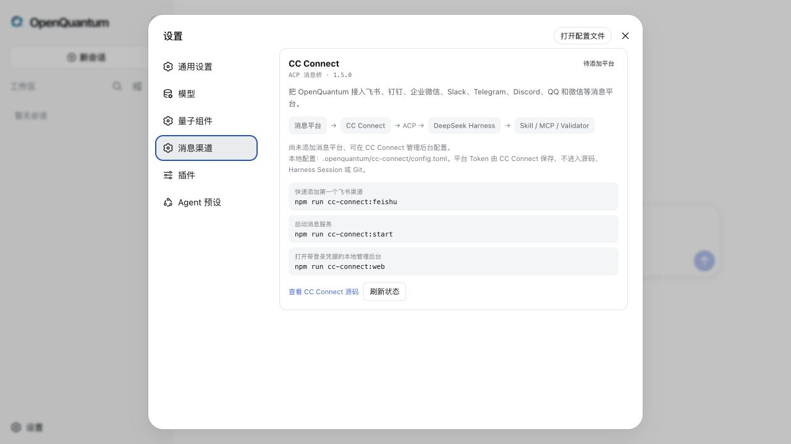

<!-- WeChat cover openquantum-wechat-cover.png -->

# 重磅更新｜OpenQuantum 把量子计算带进了微信

预计阅读 5 分钟

> 量子计算，就在指尖。OpenQuantum 现在把网页工作台、微信与飞书、量子 Skill、MCP 和科学 Validator 放进了同一个可追踪的 Agent 工作流。

OpenQuantum 开源后的第一次重磅更新来了。

这次一口气完成了三件事。

第一，微信和飞书也能成为量子计算的入口。

第二，手机和网页共用同一套量子工具、算法能力与 Harness 执行轨迹。

第三，从量子电路分析、后端发现到科学验收，OpenQuantum 已经形成了一条可以直接使用、也可以继续扩展的完整链路。

以前，它主要是一个运行在网页里的量子 Agent 工作台。

你打开浏览器，选好工作区，就可以让 Agent 分析量子电路、查文档、查询后端，或者运行一个量子算法。模型做了什么判断，调用了哪个工具，结果又是怎么得到的，都能顺着执行轨迹看下去。

这次，我把这个入口又往前推了一步。

现在，OpenQuantum 可以接进微信和飞书了。

你在手机里发出一条消息，后面连接的不是一个只会聊天的机器人，而是 OpenQuantum 已经组织好的量子工具、算法 Skill、MCP 和科学 Validator。

手机负责提出问题。

OpenQuantum 负责连接量子能力。

DeepSeek Harness 负责把整个任务可靠地跑起来。

量子计算，真的开始有一点「就在指尖」的感觉了。


*OpenQuantum 首页，从一句自然语言开始一项量子任务。*

说真的，我一直觉得量子计算离普通人很远，并不只是因为算法难。

它的入口也太碎了。

想分析一条电路，要准备 Qiskit。想确认一个 API，要翻文档。想看看 IBM Quantum、IonQ 或国内量子云，又要面对另一套接口和凭据。工具都在那里，但真正把它们用起来，常常要先跨过一长串环境和配置。

OpenQuantum 想做的，就是把这段距离缩短一点。

现在你可以在微信里问它，帮我检查这段 OpenQASM 电路。

也可以问，哪些已经配置的量子后端满足我的量子位要求。

还可以让它运行 OpenQuantum 已经做过独立科学验收的量子基态任务，再把计算结果和检查证据一起交回来。

如果只是看 Qiskit 文档、分析电路或运行本地能力，不需要真实量子云凭据。

如果要进入 IBM Quantum、IonQ 或其他真实硬件和付费服务，再由使用者配置对应密钥，明确开启相关组件。

方便归方便，该守住的边界不能丢。

这次消息渠道用的是开源项目 [CC Connect](https://github.com/chenhg5/cc-connect)。它负责连接微信、飞书、钉钉、企业微信、Slack、Telegram、Discord、QQ 等消息平台，再通过标准 ACP 协议把请求交给 DeepSeek Harness。

我没有为它重做一套 Agent Runtime。

Web 工作台和手机消息背后，仍然是同一套 Harness Session、权限、Skill、MCP 和执行记录。这样用户换了入口，开发者熟悉的轨迹和调试方式没有变，OpenQuantum 已经接入的量子能力也不需要再做一份。

调用链路其实很清楚。

```text
微信或飞书里的消息
  → CC Connect
  → ACP
  → DeepSeek Harness
  → OpenQuantum Skill / MCP / Validator
```

这也是我很喜欢这次更新的地方。

它没有把项目变得更重，而是让原来的能力走到了更多人手里。

设置中心也增加了消息渠道入口。用户可以看到 CC Connect 是否安装、本地配置是否完成、服务有没有运行，以及已经接入了哪些消息平台。

平台 Token 和 Bot Secret 不会显示在页面里，也不会写进 Git。它们仍然留在本机的 CC Connect 配置中。



*消息平台通过 CC Connect 和 ACP 进入同一个 DeepSeek Harness，再调用 OpenQuantum 已有的 Skill、MCP 与 Validator。*

顺着这次更新，我也重新整理了 OpenQuantum 的第一句话。

以前是「探索开放量子世界」。

现在是「量子计算，就在指尖」。

不是因为量子计算突然变简单了，而是因为入口终于可以更自然一点。

普通用户不需要先理解 MCP 是什么，也不需要先读懂整套工具链。他可以从一个真实问题开始，让 Agent 帮他找到合适的量子能力。

开发者看到的则是另一层。

每一次 Skill 加载、MCP 调用、权限变化和工具返回都还在 Harness 轨迹里。结果有问题，可以沿着过程往回找。涉及科学结论，还可以继续交给独立 Validator 检查。


*手机里看到答案，工作台里保留完整的 Harness 执行轨迹。*

目前 OpenQuantum 已经接入 Qiskit Circuits、Qiskit Docs、FieldQKit、TyxonQ，以及 IBM Runtime、IBM Transpiler、IonQ 和多家国内量子云的配置入口。

这里既有不需要凭据就能使用的电路分析和本地算法，也有默认关闭、需要用户明确配置后才能启用的真实硬件能力。

我还保留了一个很小但完整的量子基态参考任务。

它会运行二量子位 VQE，再用另一套独立计算检查能量、态矢、收敛轨迹和数值残差。

真实运行中，VQE 得到 -1.85727503 Ha，独立精确参考也是 -1.85727503 Ha，绝对能量差约为 4.44 × 10^-16 Ha，所有科学检查通过。


*工具运行完成只是第一步，科学结论还要经过独立检查。*

如果你已经在使用 OpenQuantum，更新代码并重新安装依赖，就能拿到这次更新。

```bash
git pull
npm ci
npm run cc-connect:setup
npm run cc-connect:feishu
```

完成第一项消息平台配置后，运行 `npm run cc-connect:start`，就可以让消息进入同一个 OpenQuantum Agent。

项目仍然采用 MIT License。

量子公司可以继续接自己的硬件和云服务，高校实验室可以沉淀自己的研究流程，算法团队可以加入新的 Skill、MCP 和 Validator。

我希望 OpenQuantum 最后能成为一块真正开放的量子工具底板。

网页是入口。

微信也可以是入口。

以后还可以有更多入口。

但后面那套开放、可追踪、可以继续开发的量子能力，始终是同一套。

量子计算，就在指尖。

项目地址

[https://github.com/xi-zhao/openQuantum](https://github.com/xi-zhao/openQuantum)

如果你在做量子硬件、量子云、算法、科研软件或者 Agent，欢迎来看看，也欢迎把你正在做的东西接进来。
