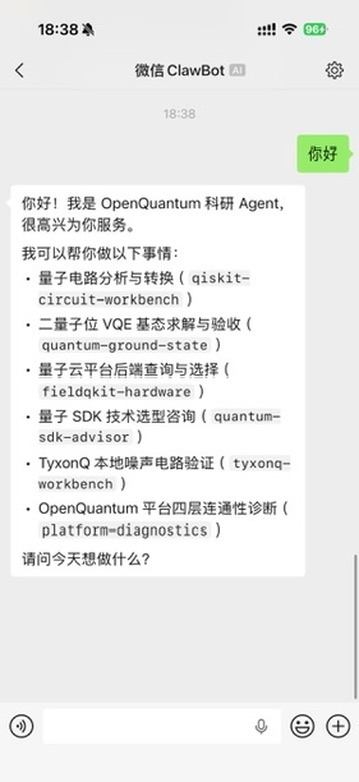
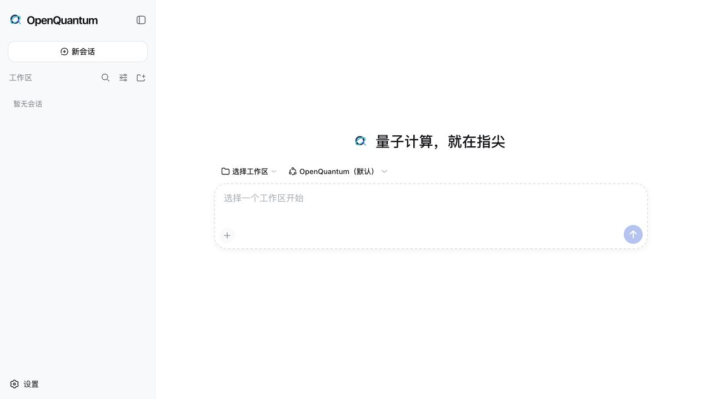
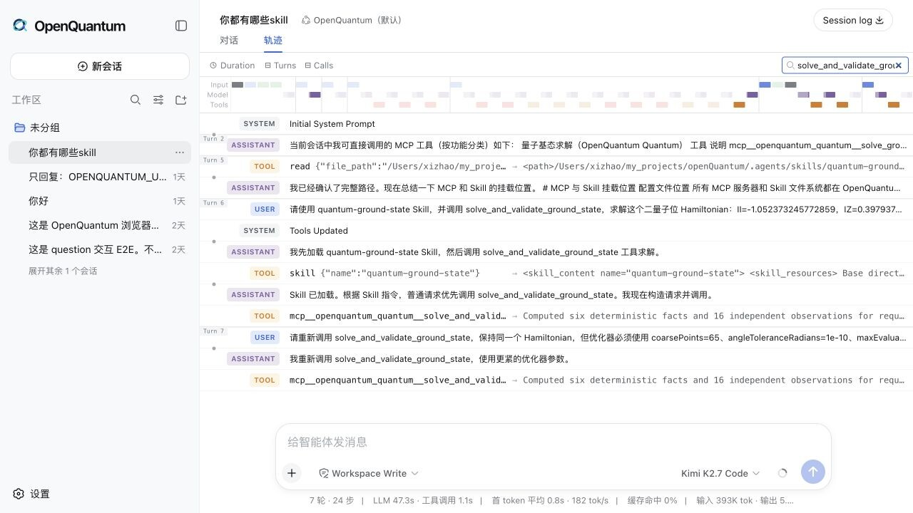
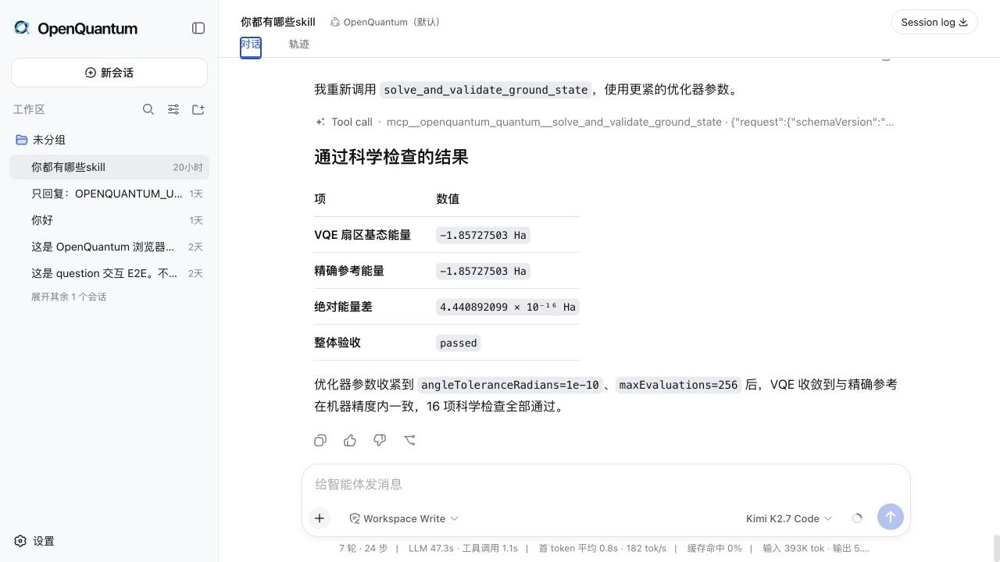

<!-- WeChat cover openquantum-wechat-cover.png -->

# 重磅更新｜我把量子计算接进了微信

预计阅读 3 分钟

> 在微信里发一句话，就能让 OpenQuantum 分析量子电路、运行算法、查询云端后端，再把结果和完整过程交回来。

今天 18:38，我在微信里发了两个字。

你好。

几秒钟后，手机里弹出了这样一段回复。

{.wechat-chat-shot}

*这是今天真实跑出来的微信对话，不是效果图。*

它没有只回我一句你好。

它告诉我，自己可以检查和转换量子电路，可以求解并验收二量子位 VQE 基态，可以查询量子云后端，可以做量子 SDK 技术选型，也可以运行 TyxonQ 本地噪声电路，甚至还能检查 OpenQuantum 整个平台是不是正常连通。

我当时盯着手机看了几秒。

怎么说呢，这种感觉还挺奇妙的。

量子计算以前给人的感觉，总是离普通人很远。先装 SDK，再配环境，然后翻文档、写代码、申请云端账号。每一步都不算离谱，但堆在一起，就足够把很多好奇的人挡在门外。

我非常理解这种感觉。

可如果我们只是想检查一段电路，问问哪台量子计算机满足要求，或者跑一个有边界的算法任务，入口真的一定要这么重吗？

所以这次，我把 OpenQuantum 接进了微信。

手机负责提问。OpenQuantum 负责找到合适的 Skill 和 MCP。DeepSeek Harness 负责把任务、权限、工具调用和执行记录可靠地串起来。

背后还是同一个 OpenQuantum。



*在网页里，可以从一句自然语言开始一项量子任务。*

DeepSeek Harness 发布以后，我用三天做出了 OpenQuantum 的第一版。想法其实很直接，把散落在不同仓库、量子云和文档里的工具，放到一个开放的工作台里。

现在，这个工作台里已经接入 Qiskit Circuits、Qiskit Docs、FieldQKit、TyxonQ 和 OpenQuantum 自己维护的量子基态能力。IBM Runtime、IBM Transpiler、IonQ 以及多家国内量子云也预留了配置入口。

不需要凭据的电路分析、文档查询和本地算法，装好就能用。

真实硬件和付费云服务默认关闭。只有用户填入自己的凭据并主动开启，OpenQuantum 才会连接对应服务。

方便归方便，真实设备、费用和科研结论的边界不能糊。

微信里看到的是答案，网页里保留的是完整过程。



*每次 Skill 加载、工具调用和执行结果，都留在同一条 Harness 轨迹里。*

我还给算法能力留了一道独立检查。

就拿量子基态任务来说，工具会运行二量子位 VQE，另一套程序再检查能量、态矢、收敛轨迹和数值残差。一次真实运行里，VQE 与独立精确参考都得到 -1.85727503 Ha，能量差约为 4.44 × 10^-16 Ha，所有科学检查通过。



*工具跑完不等于科学结论成立，结果还要经过独立验收。*

如果你也想试，配置没有想象中复杂。

先准备 Node.js 24 和 uv，然后把项目拉到本地。

```bash
git clone https://github.com/xi-zhao/openQuantum.git
cd openQuantum
npm ci
cp .env.example .env
```

在 `.env` 里填入自己的 OpenAI 兼容模型地址和 API Key。

```bash
OPENQUANTUM_PUBLIC_BASE_URL=https://your-model-endpoint.example/v1
OPENQUANTUM_PUBLIC_API_KEY=your-api-key
```

运行下面这条命令，网页端就会启动。

```bash
npm run dev
```

浏览器打开 `http://127.0.0.1:3000`，可以先体验 Qiskit 电路能力、Qiskit 文档查询和本地量子基态任务。这几项不需要量子云密钥。

如果想把个人微信也接进来，再运行三条命令。

```bash
npm run cc-connect:setup
npm run cc-connect:weixin
npm run cc-connect:start
```

微信扫描终端里的二维码，发出第一条消息，就能完成连接。飞书、钉钉、企业微信、Slack、Telegram、Discord 和 QQ 也可以通过 CC Connect 接入。

说真的，OpenQuantum 现在还很年轻，我也还在不断补它。

但今天手机里弹出那段回复的时候，我突然觉得，量子计算的入口确实可以再往前走一步。

不必先面对一堆环境和代码。

先从一句你好开始。

量子计算，就在指尖。

OpenQuantum 已经开源。

[https://github.com/xi-zhao/openQuantum](https://github.com/xi-zhao/openQuantum)
