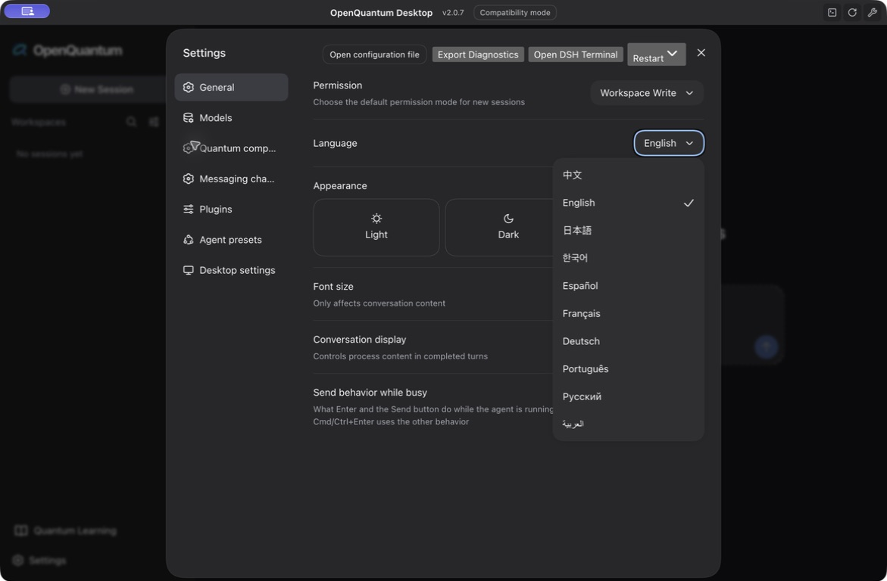

<h1 align="center">
  
</h1>

<p align="center"><strong>Put your quantum ideas to work.</strong><br /><sub>An open-source quantum agent and application platform</sub></p>

<p align="center"><a href="../../README.md">简体中文</a> · <a href="./README.en.md">English</a> · <a href="./README.ja.md">日本語</a> · <a href="./README.ko.md">한국어</a> · <a href="./README.es.md">Español</a> · <a href="./README.fr.md">Français</a> · <a href="./README.de.md">Deutsch</a> · <a href="./README.pt.md">Português</a> · <a href="./README.ru.md">Русский</a> · <a href="./README.ar.md">العربية</a></p>

OpenQuantum is an open-source agent and application platform for quantum research, experiments and teaching. Use natural language to select methods, run specialist software and inspect results; run algorithm examples directly, open Quantum Learning, or contribute your own methods and applications.

**Ask questions, run calculations and build capabilities together.** Start with a supported task, inspect the tool results, and contribute methods or applications that others can use.

Source `main` includes **49 runnable open-source algorithm examples**, alongside tools for circuits, chemistry, error correction and dynamics. Choose a method, prepare its dependencies and inspect the actual computation. Installer capabilities follow their own release notes.

[Why OpenQuantum](#why-openquantum) · [Capabilities](#what-you-can-do) · [Quick start](#quick-start) · [Results](#use-and-inspect-results) · [Extend](#extend-the-platform) · [Roadmap](#roadmap-and-rsi) · [Contribute](#documentation-and-support) · [Open source](#license-and-acknowledgments)


The research workbench is the platform's conversational and computational entry point. Quantum Learning is one integrated application, with its own classroom interface and data boundary.

## Why OpenQuantum

**People, AI and an open ecosystem can build quantum capabilities together.**

OpenQuantum builds on the quantum software ecosystem to make specialist capabilities easier to use, combine and extend. It connects domain methods, agent execution and open tools to concrete tasks. Local calculations, teaching experiments and method validation have practical value today, without depending on a QPU demonstrating an advantage.

### Start with a question, use specialist tools

**Turn a research question into exploration.** You can begin a supported task without first learning every SDK: Skills supply methods, the agent calls specialist Tools, and the workbench records inputs and results. We aim to reduce repeated setup, interface learning and workflow construction so learners can experiment and researchers can spend more time forming hypotheses, designing comparisons and judging results. These judgments remain yours.

**Create new research space by combining tools.** PyZX circuit optimization, QCEC equivalence checking and noise simulation answer different questions. Applied to one research goal, they let you ask whether a simpler ideal circuit also behaves better under noise. We are developing scientifically meaningful combinations by aligning models, units, bit order and budgets, and understanding when methods apply or fail. Connecting interfaces alone does not establish a conclusion. See each tool's current scope in the [computing guide](../integrations/SCALABLE_BRIDGES.md).

### Make one investigation the start of the next

**Leave experience that others can build on.** Reusable steps, calculation results and applicable independent checks support review and further work. We want to preserve method comparisons and failure evidence together with their conditions: why a method applies, and when to take a different route. Well-supported negative results are useful; a program error is not a scientific refutation. Complete scientific acceptance is available only within the [scope of the relevant capabilities](../../README.md#执行记录与科学验收), and organizing experience does not mean the system has learned automatically.

### Make your methods useful to others

**Help others continue creating from a research result.** A method can become a Skill, a calculation program can become a Tool, and a complete application can keep its own interface and workflows. Researchers, teachers, developers, and software or hardware partners can contribute their expertise without rebuilding the entire platform. We want existing work to enter new courses, investigations and applications. [Quantum Learning](#quantum-learning) is one current application entry point.

**Keep choice with users and contributors.** Open implementations and extension interfaces let you inspect, modify and maintain your own combination. Model services and computing backends are configured separately, so applications need not be tied to one model or device. Upstream authors, licenses and contributions remain visible; users decide whether to share research data. Our goal is to preserve professional methods that remain useful as models, computing resources and research directions change.

An investigation that becomes possible, a method applied to a new problem, or a contributor creating an application are all forms of value we want to accumulate. The next step is to make that experience improve the [capabilities used in the next round of research](#research-that-improves-how-research-is-done).

## What you can do

| Area | Available tools and results |
| --- | --- |
| Algorithm examples | QFT/QPE, Grover/Shor, HHL/VQLS/QSVT, VQE/VQD/QAOA, gradients, state preparation, DMRG, qLDPC and Schrödingerization examples; editable inputs and method-specific checks |
| Hamiltonian simulation | Trotter–Suzuki and qDrift for Pauli Hamiltonians; circuits, resource metrics, states and optional independent matrix references |
| Circuits | Qiskit and TyxonQ circuit creation, analysis, transpilation and local simulation; MQT QCEC equivalence checks; optional FlagQuantum circuit workbench |
| Local interoperability | qBraid Qiskit/Cirq unitary-circuit conversion through QASM2, Clifft intermediate measurements and raw detector/observable parities, and optional QDMI metadata queries through a configured C driver |
| Optimization and algebra | PyZX rewriting, Graphix measurement-based computing, Symmer symmetry tapering and PauLie Lie algebra calculations |
| Circuit optimization and cutting | Compact optimization with independent equivalence checks; QCut gate cutting and expectation reconstruction with sampling costs and an optional uncut reference |
| Ground states and chemistry | A bounded two-qubit VQE example, TeNPy spin-chain DMRG, SQD active-space chemistry and Flow-VQE parameter learning |
| Excited states and kernel classification | OpenQARP VQD low-energy states, residuals and orthogonality checks; optional cqlib-qml angle-kernel QSVM with held-out test results and classical baselines |
| Quantum information | toqito density-matrix and entanglement checks; RandomMeas subsystem-purity estimates |
| Error mitigation and correction | Mitiq ZNE, REM, PEC and CDR; Stim and PyMatching memory experiments; Deltakit code construction; BP+LSD decoding |
| Dynamics | Dynamiqs driven dissipative qubits, OQuPy non-Markovian evolution, TJM open Ising chains and Clifft noisy sampling |
| Optimization problems | QPanda QUBO compilation, constraint checks and local solving |
| Superconducting and atomic systems | FatQat local experiments, transmon leakage and Rydberg dynamics |
| Hardware and reference material | FieldQKit backend discovery; optional cloud job interfaces; fixed Metriq records and Quantum-Practices guides |
| Learning and teaching | Materials, slides, interactive classrooms and project-based learning through Quantum Learning |

The table describes source `main`. QCut, Compact and OpenQARP connections are enabled by default; cqlib-qml and FlagQuantum are disabled until selected. Dependencies still need preparation. See the [integration guide and verification scope](../integrations/CANDIDATE_LIBRARIES.md).

All **66 quantum-skills guides** have native Skill adaptations; **49 executable workflows** cover the **39 upstream algorithm modules** and additional methods from the guides. They use Qiskit, PennyLane, quimb, PySCF and NumPy/SciPy, with no proprietary UnitaryLab runtime dependency. Coverage describes workflows, not complete upstream Python API or backend compatibility. See the [per-method mapping and differences](../integrations/UNITARYLAB_OPEN_COVERAGE.md).

The source inventory contains **101 Skills** (88 automatically selectable and 13 manual category indexes), **37 MCP connections** and **220 configurable Tool names**. These counts describe the configured inventory; the tools available in a session depend on the platform, enabled connections, prepared environments and selected tool profiles. Existing names remain available. See the [capability catalog](../../README.md#能力接口目录) and [governance record](../architecture/EXTENSION_GOVERNANCE.md).

Each integration has its own installation requirements and scientific scope. Local results do not establish hardware performance, and a completed tool call does not automatically imply scientific acceptance. See the [detailed capability catalog](../../README.md#可以用它做什么) and [integration documentation](../README.md).

### Quantum Learning

Prepare materials, edit courseware, learn in interactive classrooms and continue project-based activities. The application keeps its own teaching workflows and local course storage.

Course resources are still being organized; a complete curriculum and full acceptance of the online AI teaching workflows remain unfinished. Teaching tasks do not automatically use the research workbench’s quantum tools. See the [learning application and its scope](../../README.md#量子学习通).

## Quick start

OpenQuantum supports desktop installers and source builds for local, single-user use. Choose an installer to use the workbench, or run from source for development and capabilities available on `main`.

### Desktop installer

Download the Mac (Apple Silicon / Intel) or Windows installer from [GitHub Releases](https://github.com/xi-zhao/OpenQuantum/releases/latest). Node.js and uv are bundled, so no source build is needed. These are unsigned test builds. Follow the [installation guide](../DESKTOP_INSTALLERS.md), open the app, then [configure a model](#configure-a-model). Follow the corresponding version's instructions for additional computation dependencies; optional applications such as Quantum Learning have separate setup steps.

The [v0.5.1 installers](../releases/v0.5.1.md) do not include the later QCut, Compact, OpenQARP, cqlib-qml and FlagQuantum integrations, the [September 22 quantum-library updates](../releases/2026-09-22-quantum-upstream-update.md), or the September 24 [algorithm adaptations](../integrations/UNITARYLAB_OPEN_ADAPTATION.md), [interoperability tools](../integrations/QUANTUM_INTEROP.md) and [governance changes](../architecture/EXTENSION_GOVERNANCE.md). Use source `main` for these updates. Changes to source do not automatically update an installed app. See the [data and migration guide](../DESKTOP_INSTALLERS.md#数据与升级).

### From source

Install Git, Node.js 24 or newer, and [uv](https://docs.astral.sh/uv/getting-started/installation/) for Python quantum tools. Individual capabilities may need additional dependencies.

```bash
git clone https://github.com/xi-zhao/openQuantum.git
cd openQuantum
npm ci
npm run dev
```

Open the login URL printed by the launcher. After authentication, the browser opens the workbench at `http://127.0.0.1:3000`.

### Desktop

To build Desktop from the same source checkout, complete the source installation above and prepare Corepack and system C++ build tools.

```bash
npm run desktop:setup
npm run desktop:verify-install
npm run desktop
```

When launched from the same source checkout, Web and Desktop share the same Harness home and configuration. Close the other host before opening the same home. See [desktop installation and platform requirements](../DEPLOYMENT.md).

### Configure a model

Open **Settings → Models**. Add an OpenAI-compatible Chat Completions provider, enter its endpoint, model name and API key, and use the OpenQuantum agent preset. The model must support **Tool Calling** to execute quantum tools.

The bundled public and private routes contain `.invalid` placeholder endpoints. Configure an actual service before using them. These are model credentials, separate from quantum cloud credentials. Existing secrets are not displayed in settings; configuration stores credential references.

No model key is needed for the fixed local reference example:

```bash
npm run demo:quantum-ground-state
```

The repository records a local check of this bounded two-qubit Hamiltonian at approximately `-1.85727503 Ha`. This is evidence for that input and particle sector, not a general performance claim. See the [recorded input, output and validation boundaries](../examples/quantum-ground-state-local-demo-2026-09-12.json).

### Try an agent task

After configuring a model and installing uv, explicitly prepare FatQat's pinned environment from the repository root:

```bash
node scripts/setup-paper-tools.mjs fatqat-workbench
```

Then ask the workbench:

> Use FatQat to prepare a Bell state from two qubits in the zero state: apply H to q0, then CX with q0 as control and q1 as target. Return the exact noiseless probabilities and compare them with 1024 samples using seed=7.

The ideal probabilities for `00` and `11` are each 50%. Finite samples fluctuate. Check that the session contains actual tool inputs and returned computation results, as well as an explanation. Setup may download dependencies; the computation does not install them automatically. Missing or stale environments produce an actionable setup command. See [local environment preparation](../integrations/LOCAL_ENVIRONMENTS.md).

### Run an algorithm example directly

No model key or quantum-cloud account is required. Start with NumPy, SciPy and Qiskit:

```bash
npm run capability:algorithms:setup -- --minimal
```

On macOS / Linux, inspect the HHL input contract and run the default example:

```bash
examples/quantum-algorithms/.venv/bin/python examples/quantum-algorithms/run.py --describe hhl
examples/quantum-algorithms/.venv/bin/python examples/quantum-algorithms/run.py --algorithm hhl
```

On Windows PowerShell:

```powershell
& examples/quantum-algorithms/.venv/Scripts/python.exe examples/quantum-algorithms/run.py --algorithm hhl
```

Add dependencies with `npm run capability:algorithms:setup -- --group pennylane`, or choose `gradients`, `tensor` or `chemistry`. Adding a group preserves other installed groups; setup without arguments still prepares the full environment. The full environment includes PySCF, for which WSL is recommended on Windows. Numerical verification was performed on macOS CPU. See the [examples, custom inputs and method differences](../../examples/quantum-algorithms/README.md).

### Upgrade an existing source installation

Follow the [source update guide](../UPDATES.md), then rerun the preparation command for each computation capability you use. Python bridges verify and synchronize pinned dependencies in their existing environment directories; no environment deletion is needed. Restart the workbench and start a new session. Existing Skill and Tool names are retained; automatic tasks use `quantum-algorithms` or a specific method instead of the 13 manual category indexes.

### Set up Quantum Learning

Prepare the full learning application in the same repository checkout used to launch OpenQuantum:

```bash
npm run learning:ui:setup
```

Then open **Quantum Learning** from the workbench sidebar. Installation and startup are verified on macOS; ordinary Windows installation is not yet supported, and Linux startup is not yet verified. A new Git worktree needs its own installation. If the app reports an incomplete installation, run the setup command from that checkout and reopen it.

The integration preserves the upstream OpenMAIC course, classroom, editing and project-learning workflows. Model access goes through the Harness model route. Local course storage is separate from the research workbench's session log. Optional media and search services require their own configuration.

The interface integration does not by itself establish teaching quality or scientific correctness. Course coverage, validation evidence and remaining work are described in the [Quantum Learning documentation](../../README.md#量子学习通).

### Interface languages

Choose **Settings → General → Language**. The initial set is Simplified Chinese, English, Japanese, Korean, Spanish, French, German, Portuguese, Russian and Arabic. The selection persists after refresh, and the embedded Quantum Learning app follows it. Arabic uses right-to-left reading direction.



Language selection changes interface text. It does not translate existing conversations, user-authored Skills, course materials, tool outputs or model responses. Ask the model for your preferred response language separately. Some native operating-system dialogs in the pinned Desktop release use English fallback outside Chinese and English.

## Use and inspect results

Choose a computing backend separately from the language model. Local calculations do not need quantum-cloud credentials. Optional IBM Quantum, IonQ and Origin Quantum job interfaces require the corresponding credentials, permissions and quota; device discovery has a separate scope.

Use the settings page to enable the required MCP Server connection, restart the workbench and specify the backend in the task. Each tool defines its own physical model, input format and resource controls. See the [backend directory](../../README.md#可以连接哪些量子后端) and [computing parameters](../integrations/SCALABLE_BRIDGES.md).

Use algorithm examples when learning or changing a method, and specialist tools when you need their defined input/output contract. [Shared selection guidance](../integrations/CAPABILITY_SELECTION.md) covers overlapping Hamiltonian, VQD, Qiskit and eigensolver entry points. Qiskit Gym, Quantum Hardware and FlagQuantum remain opt-in; their optional tool profiles expose a smaller set for a specific task, with `full` preserving the default complete interface.

A model reply, a completed tool call and scientific acceptance are separate outcomes. Inspect the actual tool input and return value; supported capabilities may also provide independent references, error estimates or a complete acceptance report with recorded provenance.

Continue with new parameters, compare results, or turn repeatable steps into a Skill. [More task examples](../../README.md#更多可复制的计算任务) and [troubleshooting](../TROUBLESHOOTING.md) provide the next steps.

## Extend the platform

- A **Skill** supplies knowledge and workflow instructions.
- A **Tool Provider** registers executable tools, either natively or through the Harness MCP Client.
- A **Scientific Validator** produces observations for a supported capability; the central Acceptance Builder determines final acceptance from the applicable profile and evidence.
- An **Agent Preset** combines the required Skills, Tool Providers and agent policies.
- Complete applications can keep their own interfaces and use bounded integration points.

OpenQuantum uses DeepSeek Harness for agent execution, sessions, approvals, tools and persistence. It does not introduce a second agent runtime. Read the [architecture overview](../README.md), [extension model](../architecture/EXTENSION_MODEL.md) and [contribution guide](../../CONTRIBUTING.md) before adding an integration.

```bash
npm run harness:config
npm run desktop:check
npm run check
```

Choose checks relevant to your change. Tests and local evidence are distinct from a published release or scientific acceptance.

## Roadmap and RSI

Our long-term goal is to help people use existing capabilities and create new ones. These are development directions, not a list of delivered features.

### Platform foundations

| Long-term track | What we aim to build |
| --- | --- |
| **0 · A more useful quantum agent** | Improve task understanding, method selection, tool calls, result interpretation and failure recovery. Measure progress through the quality, time and cost of completing real tasks. |
| **1 · An agent-ready quantum software ecosystem** | Connect specialist software and improve execution interfaces, domain Skills and dependency preparation. Preserve applicability conditions and validation records so tools and methods can be reused in real tasks. |
| **2 · Quantum, HPC and AI workflows** | Connect local CPUs, remote GPUs, HPC, quantum simulators and QPUs, and explore agent-organized quantum–classical workflows. Select resources by task size, precision, time and budget, verifying backend connections, orchestration and coordinated execution step by step. |
| **3 · Interfaces for intelligent laboratory instruments** | Prepare standardized interfaces for programmable instruments and explore device discovery, experimental control, measurement analysis and feedback, connecting computation with real experiments. |

### Applications and teaching

| Long-term track | What we aim to build |
| --- | --- |
| **4 · More high-quality courses** | Build a knowledge map from fundamentals to frontier research and develop introductory, intermediate and advanced courses. Let learners move between levels according to their knowledge and interests, connecting concepts, experiments and assessment. |
| **5 · Quantum applications for practical problems** | Integrate or co-develop complete applications around defined problems, with problem inputs, computational workflows and result displays. Users should not have to assemble the underlying tools themselves. Document each application's backends, costs, scope and validation results. |

### Personalization and improvement

| Long-term track | What we aim to build |
| --- | --- |
| **6 · Proactive, personalized support** | Use learning and research experience to understand a person's knowledge, interests and goals, suggest next topics or methods, and address missing prerequisites. Users control which records inform personalization, where they are stored and how to turn it off. |
| **7 · Research capabilities that keep improving** | Explore how task experience can improve methods and tools, then the research process itself. Evaluate changes through comparisons on new tasks, independent checks, complete costs and versions that can be rolled back, as described in the RSI direction below. |

Instrument interfaces will draw on explorations such as Anthropic's [Model Hardware Standard (MHS)](https://www.anthropic.com/news/model-hardware-standard-research-preview), starting with simulated devices and collaborative experiments. Real-time control and device constraints remain the responsibility of the corresponding drivers and control systems.

### Research that improves how research is done

**The proposed recursive self-improvement (RSI) loop is not implemented.** OpenQuantum has methods, executable tools and some scientific checking infrastructure; proposals, independent evaluation, version acceptance and benefits across iterations still need to be established.

We distinguish three levels: preserving reusable experience across tasks; improving methods, tools or workflows on new tasks; and improving how candidate changes are designed, found and tested. The last level is what makes the process recursive.

The proposed cycle is **research task → candidate improvement → independent checks and new-task comparisons → authorized version update → further research**. For example, a circuit task could produce a better way to choose optimization strategies. Test candidate strategies for equivalence and on circuits not used during development; improving the search and evaluation process itself is a further step.

Compare with a version that has not inherited the change. Report the base model, human involvement and total improvement and usage costs; check for regressions. A candidate system must not relax its own acceptance rules, remove failure evidence or extend permissions. Independent evaluation, user authorization, data boundaries and rollback are conditions for accepting a change.

Collaboration with CyberEinstein, PRAgent and RunThePaper is a future possibility, not an existing automatic workflow across projects. OpenQuantum continues to use Harness as its agent runtime. Any claim that quantum capabilities improve later AI research must include preparation, measurement, error correction and data-transfer costs; no acceleration of foundation-model training or unlimited self-improvement is assumed.

See the [full roadmap](../../README.md#长期发展规划) and [current architecture and evidence boundaries](../README.md).

## Documentation and support

- [Documentation index](../README.md)
- [Deployment](../DEPLOYMENT.md)
- [Prepare local environments](../integrations/LOCAL_ENVIRONMENTS.md)
- [Choose methods and tool profiles](../integrations/CAPABILITY_SELECTION.md)
- [Troubleshooting](../TROUBLESHOOTING.md)
- [Development roadmap](../../README.md#长期发展规划)
- [Report an issue](https://github.com/xi-zhao/openQuantum/issues)

This language edition covers product use and contribution entry points. Detailed technical documents are currently primarily in Chinese. Corrections to translations are welcome.

Contribute a reusable case, a checked negative result, a tool, a course or an application. Include authorship, sources, licenses, conditions and validation scope. Share only authorized material; private sessions, unpublished data and credentials do not belong in public contributions.

**[Start a quantum task](#quick-start)** · [Contribute a capability](../../CONTRIBUTING.md)

**OpenQuantum · Quantum computing at your fingertips.**

## License and acknowledgments

OpenQuantum's own code is under the [MIT license](../../LICENSE). DeepSeek Harness, OpenMAIC and the quantum ecosystem projects retain their original authorship, licenses and usage conditions. Some components have separate licenses. Consult [Third-party notices](../../THIRD_PARTY_NOTICES.md) before redistribution or enabling an optional integration.
