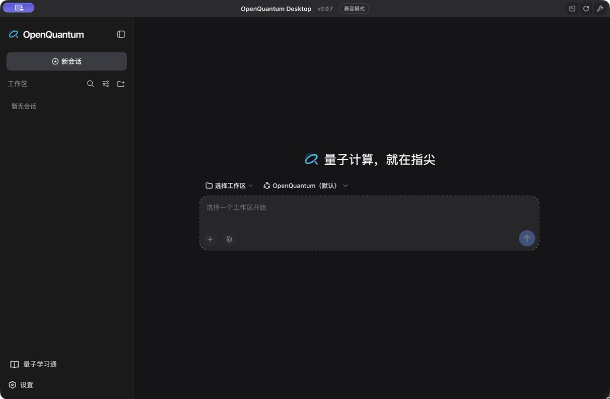

<h1 align="center"></h1>

<p align="center"><strong>Pon tus ideas cuánticas en marcha.</strong><br /><sub>Una plataforma abierta de agentes y aplicaciones cuánticas</sub></p>

<p align="center"><a href="../../README.md">简体中文</a> · <a href="./README.en.md">English</a> · <a href="./README.ja.md">日本語</a> · <a href="./README.ko.md">한국어</a> · <a href="./README.es.md">Español</a> · <a href="./README.fr.md">Français</a> · <a href="./README.de.md">Deutsch</a> · <a href="./README.pt.md">Português</a> · <a href="./README.ru.md">Русский</a> · <a href="./README.ar.md">العربية</a></p>

OpenQuantum reúne herramientas cuánticas, métodos especializados y aplicaciones completas. Puedes pedir cálculos a un agente de IA, utilizar una aplicación integrada o incorporar tus propios algoritmos y servicios. Los servicios de modelos y los recursos de cómputo se configuran por separado.

**Plantea preguntas, ejecuta cálculos y construye nuevas capacidades con otros.**



## Qué puedes hacer

Simula circuitos con Qiskit y TyxonQ; optimízalos con PyZX; explora computación basada en medidas con Graphix, reducción por simetrías con Symmer y álgebra de Lie con PauLie. TeNPy, SQD y Flow-VQE cubren estados fundamentales y química. Mitiq permite mitigar errores; Stim, PyMatching, Deltakit y BP+LSD permiten estudiar su corrección. Dynamiqs, OQuPy, TJM y Clifft abordan dinámica y ruido; FatQat incluye experimentos con sistemas superconductores y atómicos. FieldQKit permite descubrir dispositivos y Quantum Learning ofrece aulas y materiales de aprendizaje.

El código de `main` también incluye corte de puertas y reconstrucción de valores esperados con QCut, optimización de circuitos con Compact y estados excitados mediante VQD con OpenQARP. Estas conexiones están activadas por defecto, pero requieren preparar sus dependencias. El QSVM con núcleo angular de cqlib-qml y el entorno de circuitos FlagQuantum están desactivados hasta que los habilites. Consulta el [alcance y la verificación](../integrations/CANDIDATE_LIBRARIES.md).

Cada integración tiene dependencias y un alcance científico propios. Un cálculo local no demuestra el rendimiento del hardware real. Completar una llamada a una herramienta tampoco equivale a superar una validación científica.

## Por qué elegir OpenQuantum

**De la pregunta al cálculo.** Describe una tarea compatible en lenguaje natural y el agente invocará las herramientas especializadas. Tú defines las entradas y los supuestos físicos, y evalúas los resultados.

**Cada investigación como punto de partida.** El espacio de trabajo conserva las entradas y los resultados de las herramientas para continuar con otros parámetros. La validación científica depende del alcance de cada capacidad.

**Tus métodos, al alcance de otros.** Puedes aportar Skills, herramientas de cálculo, materiales y aplicaciones. Los modelos y los recursos de cómputo se configuran por separado; se mantienen la autoría y las licencias de los proyectos originales.

## Inicio rápido

Para uso local individual, puedes elegir el instalador de escritorio o ejecutar la aplicación desde el código fuente.

### Instalador de escritorio

Descarga el instalador para Mac (Apple Silicon / Intel) o Windows desde [GitHub Releases](https://github.com/xi-zhao/OpenQuantum/releases/latest). Incluye Node.js y uv: no necesitas compilar el código fuente. Son compilaciones de prueba sin firma. Sigue la [guía de instalación](../DESKTOP_INSTALLERS.md), abre la aplicación y configura un modelo. Algunas dependencias de Python se descargan en el primer uso; Quantum Learning y otras aplicaciones opcionales requieren preparación adicional.

Los [instaladores v0.5.1](../releases/v0.5.1.md) no incluyen las capacidades añadidas posteriormente a `main` ni las [actualizaciones de bibliotecas cuánticas del 22 de septiembre](../releases/2026-09-22-quantum-upstream-update.md). Los cambios en el código fuente no actualizan automáticamente la aplicación instalada.

### Ejecutar desde el código fuente

Para desarrollar o usar las capacidades de `main`, prepara Git, Node.js 24 o posterior y uv para las herramientas de Python. Después sigue estos pasos.

[uv](https://docs.astral.sh/uv/getting-started/installation/)

```bash
git clone https://github.com/xi-zhao/openQuantum.git
cd openQuantum
npm ci
npm run dev
```

Abre el enlace de acceso que aparece en el registro de inicio. Tras autenticarte, verás el espacio de trabajo en el navegador.

### Configurar un modelo

En Configuración → Modelos, introduce la URL, el nombre del modelo y la clave API de un proveedor compatible con OpenAI-compatible Chat Completions. Selecciona el Agent Preset de OpenQuantum. El modelo debe admitir Tool Calling para ejecutar herramientas. Las direcciones .invalid incluidas son marcadores: sustitúyelas por un servicio real. Las credenciales del modelo son independientes de las de la nube cuántica.

Puedes ejecutar el ejemplo local de referencia de un Hamiltoniano fijo de dos cúbits sin clave de modelo.

```bash
npm run demo:quantum-ground-state
```

Con el modelo configurado, prueba: «Usa FatQat para preparar un estado de Bell desde dos cúbits en cero. Aplica H a q0 y después CX con q0 como control y q1 como objetivo. Compara las probabilidades exactas con 1024 muestras y seed=7». Las probabilidades ideales de 00 y 11 son del 50% cada una. Comprueba las entradas de la herramienta y los resultados del cálculo. El primer uso puede descargar dependencias.

### Escritorio

Para compilar Desktop desde la misma copia del código, completa la instalación desde fuentes y prepara Corepack y las herramientas de compilación de C++ del sistema.

```bash
npm run desktop:setup
npm run desktop:verify-install
npm run desktop
```

Web y Desktop comparten los datos y la configuración de Harness cuando se inician desde la misma copia del código fuente. Cierra el otro host antes de utilizar el mismo directorio de datos.

## Quantum Learning

Prepara la aplicación educativa en la misma copia del repositorio desde la que inicias OpenQuantum.

```bash
npm run learning:ui:setup
```

Abre Quantum Learning desde la barra lateral. Cada nuevo Git worktree necesita su propia instalación. Si aparece un aviso de instalación incompleta, ejecuta el comando anterior en ese worktree y vuelve a abrir la aplicación. Se conservan los flujos de materiales, aulas y edición de OpenMAIC; los modelos se utilizan a través de Harness. Los datos de las aulas se guardan por separado del registro de sesiones.

## Idiomas

En Configuración → General → Idioma puedes elegir chino simplificado, inglés, japonés, coreano, español, francés, alemán, portugués, ruso o árabe. La elección se guarda y se sincroniza con Quantum Learning. El árabe utiliza dirección de derecha a izquierda. No se traducen las conversaciones existentes, los cursos, los Skills del usuario ni los resultados de las herramientas. Algunos diálogos nativos usan inglés cuando el idioma no es chino o inglés.

## Documentación y contribuciones

Los Skills aportan conocimiento y procedimientos; los Tool Providers registran herramientas ejecutables. Las capacidades que requieren comprobación científica utilizan un Validator independiente y evidencias para determinar la aceptación. OpenQuantum reutiliza el entorno de ejecución de DeepSeek Harness. Consulta las ediciones inglesa y china para obtener instrucciones detalladas de uso y extensión.

[English](./README.en.md) · [中文](../../README.md) · [Documentation](../README.md) · [Contributing](../../CONTRIBUTING.md) · [Issues](https://github.com/xi-zhao/openQuantum/issues)

```bash
npm run harness:config
npm run desktop:check
npm run check
```

## Visión a largo plazo y RSI

Exploramos la colaboración entre computación cuántica, HPC e IA, nuevas aplicaciones y materiales educativos, y la mejora de los métodos de investigación. La automejora recursiva (RSI) es una línea de investigación: el ciclo propuesto aún no está implementado. Su evaluación requiere comprobaciones independientes, comparación en tareas nuevas, coste total, autorización del usuario y posibilidad de volver a una versión anterior.

[Hoja de ruta detallada](../../README.md#rsi).

## Licencia

El código propio de OpenQuantum usa la licencia MIT. DeepSeek Harness, OpenMAIC y los proyectos cuánticos conservan su autoría y sus licencias. Consulta Third-party notices antes de redistribuir o activar integraciones opcionales.

[MIT](../../LICENSE) · [Third-party notices](../../THIRD_PARTY_NOTICES.md)
